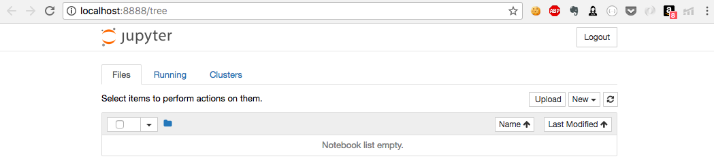
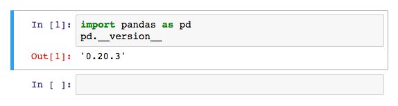

Manipulating Data with the Pandas Library
=========================================

In the next few portions of the course, we are going to get our hands
dirty by building the various kinds of recommender systems that were
introduced in lab one. However, before we do so, it is important
that we know how to handle, manipulate, and analyze data efficiently in
Python.

The datasets we\'ll be working with will be several megabytes in size.
Historically, Python has never been well-known for its speed of
execution. Therefore, analyzing such huge amounts of data using vanilla
Python and the built-in data structures it provides us is simply
impossible.

In this lab, we\'re going to get ourselves acquainted with the
pandas library, which aims to overcome the aforementioned limitations,
making data analysis in Python extremely efficient and user-friendly.
We\'ll also introduce ourselves to the *Movies Dataset* that we\'re
going to use to build our recommenders as well as use pandas to extract
some interesting facts and narrate the history of movies using data.


Setting up the environment
==========================

Open Lab environment URL and open Jupyter lab or notebook:



To the right of the window, you should be able to see a
[New] dropdown. Click it and create a new Python 3 (or
Python 2) Notebook. Doing so will open a new tab with an untitled
notebook. You\'ll also be able to see an input cell with a pointer in
it. This is space where we write our code (and markdown). Go ahead and
type the following lines:


```
import pandas as pd
pd.__version__
```


To execute the code in this cell, press *Shift* + *Enter.* If all goes
well, you should see a new output cell, which prints the version of the
pandas library:





The Pandas library
==================

Pandas is a package that gives us access to high-performance,
easy-to-use tools and data structures for data analysis in Python.

As we stated in the introduction, Python is a slow language. Pandas
overcomes this by implementing heavy optimization using the C
programming language. It also gives us access to Series and DataFrame,
two extremely powerful and user-friendly data structures imported from
the R Statistical Package.

Pandas also makes importing data from external files into the Python
environment a breeze. It supports a wide variety of formats, such as
JSON, CSV, HDF5, SQL, NPY, and XLSX.

As a first step toward working with pandas, let\'s import our movies
data into our Jupyter Notebook. To do this, we need the path to where
our dataset is located. This can be a URL on the internet or your local
computer. We highly recommend downloading the data to your local
computer and accessing it from a local path instead of from a web URL.


Go to the following URL to download the required CSV file:
<https://www.kaggle.com/rounakbanik/the-movies-dataset/downloads/movies_metadata.csv/7.>


Create a new folder called [data] in the [RecoSys] directory
and move the [movies\_metadata.csv] file that you just downloaded
into this folder. Now, let\'s witness some pandas magic. In the Jupyter
Notebook you ran in the previous section, go to the second cell and type
the following code:


```
#Read the CSV File into df
df = pd.read_csv('../data/movies_metadata.csv')

#We will find out what the following code does a little later!
df.head()
```


Et voila! You should be able to see a table-like structure with five
rows, each row representing a movie. You can also see that the table has
24 columns, although the columns were truncated to fit in the display.

What is this structure though? Let\'s find out by running the familiar
[type] command:


```
#Output the type of df
type(df)
```


You should get an output stating that df is a
[pandas.core.frame.DataFrame]*.* In other words, our code has read
the CSV file into a pandas DataFrame object. But what are DataFrames?
Let\'s find that out in the next section.


The Pandas DataFrame
====================

As we saw in the previous section, the [df.head()] code outputted
a table-like structure. In essence, the DataFrame is just that: a
two-dimensional data structure with columns of different data types. You
can think of it as an SQL Table. Of course, just being a table of rows
and columns isn\'t what makes the DataFrame special. The DataFrame gives
us access to a wide variety of functionality, some of which we\'re going
to explore in this section.

Each row in our DataFrame represents a movie. But how many movies are
there? We can find this out by running the following code:


```
#Output the shape of df
df.shape

OUTPUT:
(45466, 24)
```


The result gives us the number of rows and columns present in df. We can
see that we have data on 45,466 movies.

We also see that we have 24 columns. Each column represents a feature or
a piece of metadata about the movie. When we ran [df.head()]*,* we
saw that most of the columns were truncated to fit in the display. To
view all the columns (henceforth, called features) we have, we can run
the following:


```
#Output the columns of df
df.columns

OUTPUT:

Index(['adult', 'belongs_to_collection', 'budget', 'genres', 'homepage', 'id',
       'imdb_id', 'original_language', 'original_title', 'overview',
       'popularity', 'poster_path', 'production_companies',
       'production_countries', 'release_date', 'revenue', 'runtime',
       'spoken_languages', 'status', 'tagline', 'title', 'video',
       'vote_average', 'vote_count'],
      dtype='object')
```


We see that we have a lot of information on these movies, including
their title, budget, genres, release date, and revenue.

Next, let\'s find out how to access a particular movie (or row). The
first way to do this is by using the [.iloc] method. This allows
us to select rows based on the numeric position, starting from zero. For
example, if we wanted to access the second movie in the DataFrame, we\'d
run:


```
#Select the second movie in df
second = df.iloc[1]
second
```


The output will give you information about the movie on each of its 24
features. We see that the title of the movie is *Jumanji* and that it
was released on December 15th, 1995, among other things.


A cell will always print the output of the last line of code. Therefore,
we don\'t need to explicitly write it within a [print] function.


The second way to do it is by accessing the DataFrame index. Since we
didn\'t explicitly set an index while reading the CSV file, pandas
defaulted it to zero-based indexing. We can change the index of df quite
easily. Let\'s change the index to the title of the movie and try to
access [Jumanji] using this index:


```
#Change the index to the title
df = df.set_index('title')

#Access the movie with title 'Jumanji'
jum = df.loc['Jumanji']
jum
```


You should see an output identical to the previous cell. Let\'s revert
back to our zero-based numeric index:


```
#Revert back to the previous zero-based indexing
df = df.reset_index()
```


It is also possible to create a new, smaller DataFrame with fewer
columns. Let\'s create a new DataFrame that only has the following
features: [title], [release\_date], [budget],
[revenue], [runtime], and [genres]:


```
#Create a smaller dataframe with a subset of all features
small_df = df[['title', 'release_date', 'budget', 'revenue', 'runtime', 'genres']]

#Output only the first 5 rows of small_df
small_df.head()
```


You should see a table with five movies and only the features that
we\'ve mentioned. The [.head()] method simply displays the first
five rows of the DataFrame. You can display as many rows as you want by
passing it as an argument into [.head()]*:*


```
#Display the first 15 rows
small_df.head(15)
```


Next, let\'s check out the data types of our various features:


```
#Get information of the data types of each feature
small_df.info()

OUTPUT:
<class 'pandas.core.frame.DataFrame'>
RangeIndex: 45466 entries, 0 to 45465
Data columns (total 6 columns):
title 45460 non-null object
release_date 45379 non-null object
budget 45466 non-null object
revenue 45460 non-null float64
runtime 45203 non-null float64
genres 45466 non-null object
dtypes: float64(2), object(4)
memory usage: 2.1+ MB
```


A curious observation here is that pandas correctly deciphers
[revenue] and [runtime] as float data, but assigns the
generic object data type to [budget]*.*

However, pandas allows us to manually convert the data type of a
feature. Let\'s try to convert the [budget] feature to
[float]:


```
#Convert budget to float
df['budget'] = df['budget'].astype('float')

OUTPUT:
...
...
ValueError: could not convert string to float: '/zaSf5OG7V8X8gqFvly88zDdRm46.jpg'
```


Running this cell throws [ValueError]. It is easy to guess that
one of the budget fields had a [\'/zaSf\...\'] string as its
value, and pandas was not able to convert this into a floating number.

To solve this problem, we will use the [apply()] method. This will
allow us to apply a function to every field in a particular column and
convert it into the return value. We are going to convert every number
field in [budget] to float and, if that fails, convert it to
[NaN]:


```
#Import the numpy library 
import numpy as np

#Function to convert to float manually
def to_float(x):
    try:
        x = float(x)
    except: 
        x = np.nan
    return x

#Apply the to_float function to all values in the budget column
small_df['budget'] = small_df['budget'].apply(to_float)

#Try converting to float using pandas astype
small_df['budget'] = small_df['budget'].astype('float')

#Get the data types for all features
small_df.info()
```


This time around, there are no errors thrown. Also, we notice that the
[budget] feature is now of the [float64] type.

Now, let\'s try to define a new feature, called [year], that
represents the year of release. The recommended way to do this would be
by using the [datetime] functionality that pandas gives us:


```
#Convert release_date into pandas datetime format
small_df['release_date'] = pd.to_datetime(small_df['release_date'], errors='coerce')

#Extract year from the datetime
small_df['year'] = small_df['release_date'].apply(lambda x: str(x).split('-')[0] if x != np.nan else np.nan)

#Display the DataFrame with the new 'year' feature
small_df.head()
```


What are the oldest movies available in this dataset? To answer this
question, we can sort the DataFrame based on the year of release:


```
#Sort DataFrame based on release year
small_df = small_df.sort_values('year')

small_df.head()
```


We see that we have movies from as early as the 1870s, with *Passage of
Venus* being the oldest movie on record. Next, let\'s find out the most
successful movies of all time. To do this, we\'ll use the
[sort\_values()] method once again, but with an additional
[ascending=False] parameter to sort [DataFrame] in
descending order:


```
#Sort Movies based on revenue (in descending order)
small_df = small_df.sort_values('revenue', ascending=False)

small_df.head()
```


From our results, we observe that *Avatar* is the most successful movie
of all time, with a revenue of over \$2.78 billion.

Let\'s say we wanted to create a new DataFrame of movies that satisfied
a certain condition. For instance, we only want movies that earned more
than \$1 billion. Pandas makes this possible using its Boolean Indexing
feature. Let\'s see this in action:


```
#Select only those movies which earned more than 1 billion
new = small_df[small_df['revenue'] > 1e9]
new
```


It is also possible to apply multiple conditions. For instance, let\'s
say we only wanted movies that earned more than \$1 billion, but where
the outlay less than \$150 million, we\'d do it as follows:


```
#Select only those movies which earned more than 1 billion and spent less than 150 million

new2 = small_df[(small_df['revenue'] > 1e9) & (small_df['budget'] < 1.5e8)]
new2
```


Only four movies make it into this list.

There is, of course, much more to what you can do with DataFrames (such
as handling missing data), but we\'ll stop our exploration with it for
now. Let\'s move on to another data structure we have unknowingly used
extensively in this section: the Pandas Series.


The Pandas Series
=================

When we accessed the Jumanji movie using [.loc] and
[.iloc]*,* the data structures returned to us were Pandas Series
objects. You may have also noticed that we were accessing entire columns
using [df\[column\_name\]]*.* This, too, was a Pandas Series
object:


```
type(small_df['year'])

OUTPUT:
pandas.core.series.Series
```


The Pandas Series is a one-dimensional labelled array capable of holding
data of any type. You may think of it as a Python list on steroids. When
we were using the [.apply()] and [.astype()] methods in the
previous section, we were actually using them on these Series objects.

Therefore, like the DataFrame, the Series object comes with its own
group of extremely useful methods that make data analysis a breeze.

First, let\'s check out the shortest- and longest-running movies of all
time. We will do this by accessing the [runtime] column of the
DataFrame as a Series object and applying its methods on it:


```
#Get the runtime Series object
runtime = small_df['runtime']

#Print the longest runtime of any movie
print(runtime.max())

#Print the shortest runtime of any movie
print(runtime.min())
```


We see that the longest movie is more than 1,256 minutes in length and
the shortest is 0! Of course, such strange results demand a deeper
inspection of the data but we shall skip that, for now.

It is also possible to calculate the mean and median of the Series in
this way. Let\'s do so for the movie budgets:


```
#Get the budget Series object
budget = small_df['budget']

#Print the mean budget of the movies
print(budget.mean())

#Print the median budget of the movies
print(budget.median())
```


The average budget of a movie is \$4.2 million and the median budget is
0! This suggests that at least half the movies in our dataset have no
budget at all! Like in the previous case, such strange results demand
closer inspection. In this case, it is highly likely that a zero budget
indicates that the data is not available.

What is the revenue that the 90th-percentile movie generated? We can
discover this using the [quantile] function:


```
#Get the revenue Series object
revenue = small_df['revenue']

#Revenue generated by the 90th percentile movie
revenue.quantile(0.90)
```


We get a result of \$8.26 million. What this means is that only 10% of
the movies in our dataset earned more than \$8.26 million in revenue.

Finally, let\'s find out the number of movies released each year. We do
this using the [value\_counts()] method on the [year]
series:


```
#Get number of movies released each year
small_df['year'].value_counts()
```


We have the highest number of movies released in 2014. There are also
six years in our dataset (including 2020) that have only one movie on
record.

We\'ll stop our tour of the pandas library here. As I have already
mentioned, there is much more to pandas than what we have covered in
this lab. However, this should be sufficient to tackle the
data-wrangling and analysis tasks that we\'ll encounter while building
our recommenders.

You may rename the notebook as [Lab2] by clicking on
[Untitled] and then close it. For the next lab, we
will create a new notebook.


Summary
=======

In this lab, we gained an understanding of the limitations of using
vanilla Python and its built-in data structures. We acquainted ourselves
with the Pandas library and learned how it overcomes the aforementioned
difficulties by giving us access to extremely powerful and easy-to-use
data structures. We then explored the two main data structures, Series
and DataFrame, by analyzing our movies-metadata dataset.
