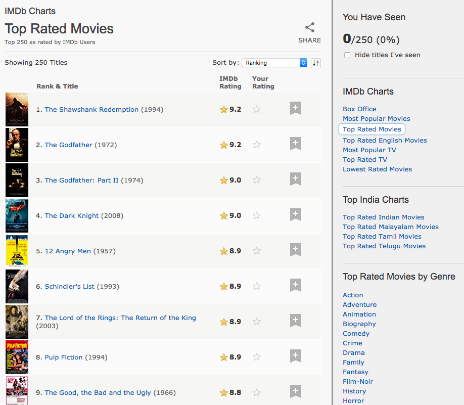
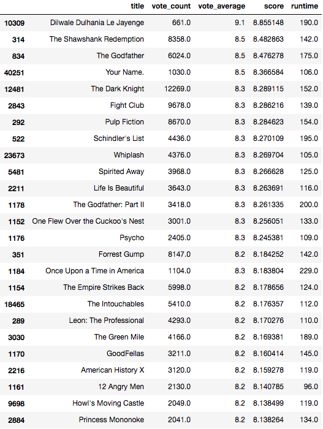
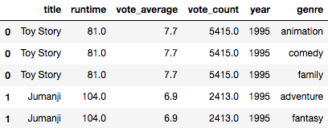
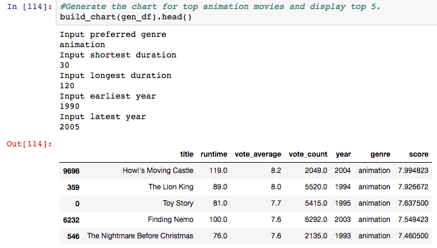

Lab 3: Building an IMDB Top 250 Clone with Pandas
=================================================

The **Internet Movie** **Database** (**IMDB**) maintains a chart called
the IMDB Top 250, which is a ranking of the top 250 movies according
to a certain scoring metric. All the movies in this list are
non-documentary, theatrical releases with a runtime of at least 45
minutes and over 250,000 ratings:





This chart can be considered the simplest of recommenders. It doesn\'t
take into consideration the tastes of a particular user, nor does it try
to deduce similarities between different movies. It simply calculates a
score for every movie based on a predefined metric and outputs a sorted
list of movies based on that score.

In this lab, we will be covering the following:

-   Building a clone of the IMDB Top 250 chart (henceforth referred to
    as the simple recommender).
-   Taking the functionalities of the chart one step further and
    building a knowledge-based recommender. This model takes user
    preferences with regards to genre, timeframe, runtime, language, and
    so on, and recommends movies that satisfy all conditions.


The simple recommender
======================

The first step in building our simple recommender is setting up our
workspace. Let\'s create a new directory named [Lab3].
Create a Jupyter Notebook in this directory named [Simple
Recommender] and open it in the browser.

Let\'s now load the dataset we used in the previous lab into our
notebook.


In case you have not downloaded it already, the dataset is available at\
<https://www.kaggle.com/rounakbanik/the-movies-dataset/downloads/movies_metadata.csv/7>.


```
import pandas as pd
import numpy as np

#Load the dataset into a pandas dataframe
df = pd.read_csv('../movies_metadata.csv')

#Display the first five movies in the dataframe
df.head()
```
or you can load straight from kagglehub:

```
import kagglehub

# Download latest version
path = kagglehub.dataset_download("rounakbanik/the-movies-dataset")

print("Path to dataset files:", path)

df = pd.read_csv(path + "/movies_metadata.csv")

df.head()
```


Upon running the cell, you should see a familiar table-like structure
output in the notebook.

Building the simple recommender is fairly straightforward. The steps are
as follows:

1.  Choose a metric (or score) to rate the movies on
2.  Decide on the prerequisites for the movie to be featured on the
    chart
3.  Calculate the score for every movie that satisfies the conditions
4.  Output the list of movies in decreasing order of their scores


The metric
==========

The metric is the numeric quantity based on which we rank movies. A
movie is considered to be better than another movie if it has a higher
metric score than the other movie. It is very important that we have a
robust and a reliable metric to build our chart upon to ensure a good
quality of recommendations.


The prerequisties
=================

The variable **m** in the IMDb weighted rating formula sets a threshold for movie popularity, ensuring that only films with a certain number of votes are considered for the rankings. It is defined as the number of votes of the 80th percentile movie in the dataset, meaning that only movies with more votes than 80% of other films qualify.

The choice of **m** can be adjusted to control the balance between popularity and score quality. A higher value of **m** makes the rankings more selective, focusing on well-known films, while a lower value allows more movies to be considered, including lesser-known titles. Experimenting with different values helps optimize the recommender's performance.

Let us now calculate the value of *m*:


```
#Calculate the number of votes garnered by the 80th percentile movie
m = df['vote_count'].quantile(0.80)
m
```

OUTPUT:
50.0


We can see that only 20% of the movies have gained more than 50 votes.
Therefore, our value of *m* is [50].

Another prerequisite that we want in place is the runtime. We will only
consider movies that are greater than [45 minutes] and less than
[300 minutes] in length. Let us define a new DataFrame,
[q\_movies], which will hold all the movies that qualify to appear
in the chart:


```
#Only consider movies longer than 45 minutes and shorter than 300 minutes
q_movies = df[(df['runtime'] >= 45) & (df['runtime'] <= 300)]

#Only consider movies that have garnered more than m votes
q_movies = q_movies[q_movies['vote_count'] >= m]

#Inspect the number of movies that made the cut
q_movies.shape
```

OUTPUT:
(8963, 24)


We see that from our dataset of 45,000 movies approximately 9,000 movies
(or 20%) made the cut.


Calculating the score
=====================

The final value that we need to discover before we calculate our scores
is *C,* the mean rating for all the movies in the dataset:


```
# Calculate C
C = df['vote_average'].mean()
C
```

OUTPUT:
5.6182072151341851


We can see that the average rating of a movie is approximately 5.6/10.
It seems that IMDB happens to be particularly strict with their ratings.
Now that we have the value of *C,* we can go about calculating our score
for each movie.

First, let us define a function that computes the rating for a movie,
given its features and the values of *m* and *C*:


```
# Function to compute the IMDB weighted rating for each movie
def weighted_rating(x, m=m, C=C):
    v = x['vote_count']
    R = x['vote_average']
    # Compute the weighted score
    return (v/(v+m) * R) + (m/(m+v) * C)
```


Next, we will use the familiar [apply] function on our
[q\_movies] DataFrame to construct a new feature score. Since
the calculation is done for every row, we will set the axis to [1]
to denote row-wise operation:


```
# Compute the score using the weighted_rating function defined above
q_movies['score'] = q_movies.apply(weighted_rating, axis=1)
```


Sorting and output
==================

There is just one step left. We now need to sort our DataFrame on the
basis of the score we just computed and output the list of top movies:





And voila! You have just built your very first recommender.
Congratulations!

We can see that the Bollywood film *Dilwale Dulhania Le Jayenge* figures
at the top of the list. We can also see that it has a noticeably smaller
number of votes than the other Top 25 movies. This strongly suggests
that we should probably explore a higher value of *m.* This is left as
an exercise for the reader; experiment with different values of *m* and
observe how the movies in the chart change.


The knowledge-based recommender
===============================

In this section, we are going to go ahead and build a knowledge-based
recommender on top of our IMDB Top 250 clone. This will be a simple
function that will perform the following tasks:

1.  Ask the user for the genres of movies he/she is looking for
2.  Ask the user for the duration
3.  Ask the user for the timeline of the movies recommended
4.  Using the information collected, recommend movies to the user that
    have a high weighted rating (according to the IMDB formula) and that
    satisfy the preceding conditions

The data that we have has information on the duration, genres, and
timelines, but it isn\'t currently in a form that is directly usable. In
other words, our data needs to be wrangled before it can be put to use
to build this recommender.

In our [Lab3] folder, let\'s create a new Jupyter Notebook
named [Knowledge Recommender]. This notebook will contain all
the code that we write as part of this section.

As usual, let us load our packages and the data into our notebook.
Let\'s also take a look at the features that we have and decide on the
ones that will be useful for this task:


```
import pandas as pd
import numpy as np

df = pd.read_csv('../data/movies_metadata.csv')

#Print all the features (or columns) of the DataFrame
df.columns
```

**Output**

```
OUTPUT:
Index(['adult', 'belongs_to_collection', 'budget', 'genres', 'homepage', 'id',
       'imdb_id', 'original_language', 'original_title', 'overview',
       'popularity', 'poster_path', 'production_companies',
       'production_countries', 'release_date', 'revenue', 'runtime',
       'spoken_languages', 'status', 'tagline', 'title', 'video',
       'vote_average', 'vote_count'],
      dtype='object')
```


From our output, it is quite clear which features we do and do not
require. Now, let\'s reduce our DataFrame to only contain features that
we need for our model:


```
#Only keep those features that we require 
df = df[['title','genres', 'release_date', 'runtime', 'vote_average', 'vote_count']]

df.head()
```


Next, let us extract the year of release from our [release\_date]
feature:


```
#Convert release_date into pandas datetime format
df['release_date'] = pd.to_datetime(df['release_date'], errors='coerce')

#Extract year from the datetime
df['year'] = df['release_date'].apply(lambda x: str(x).split('-')[0] if x != np.nan else np.nan)
```


Our [year] feature is still an [object] and is riddled with
[NaT] values, which are a type of null value used by Pandas.
Let\'s convert these values to an integer, [0], and convert the
datatype of the [year] feature into [int].

To do this, we will define a helper function, [convert\_int], and
apply it to the [year] feature:


```
#Helper function to convert NaT to 0 and all other years to integers.
def convert_int(x):
    try:
        return int(x)
    except:
        return 0

#Apply convert_int to the year feature
df['year'] = df['year'].apply(convert_int)
```


We do not require the [release\_date] feature anymore. So let\'s
go ahead and remove it:


```
#Drop the release_date column
df = df.drop('release_date', axis=1)

#Display the dataframe
df.head()
```


The [runtime] feature is already in a form that is usable. It
doesn\'t require any additional wrangling. Let us now turn our attention
to [genres].


Genres
======

Upon preliminary inspection, we can observe that the genres are in a
format that looks like a JSON object (or a Python dictionary). Let us
take a look at the [genres] object of one of our movies:


```
#Print genres of the first movie
df.iloc[0]['genres']
```

OUTPUT:
"[{'id': 16, 'name': 'Animation'}, {'id': 35, 'name': 'Comedy'}, {'id': 10751, 'name': 'Family'}]"


We can observe that the output is a stringified dictionary. In order for
this feature to be usable, it is important that we convert this string
into a native Python dictionary. Fortunately, Python gives us access to
a function called [literal\_eval] (available in the [ast]
library) which does exactly that. [literal\_eval] parses any
string passed into it and converts it into its corresponding Python
object:


```
#Import the literal_eval function from ast
from ast import literal_eval

#Define a stringified list and output its type
a = "[1,2,3]"
print(type(a))

#Apply literal_eval and output type
b = literal_eval(a)
print(type(b))
```

```
OUTPUT:
<class 'str'>
<class 'list'>
```

We now have all the tools required to convert the *genres* feature into
the Python dictionary format.

Also, each dictionary represents a genre and has two keys: [id]
and [name]. However, for this exercise (as well as all
subsequent exercises), we only require the [name]. Therefore, we
shall convert our list of dictionaries into a list of strings, where
each string is a genre name:


```
#Convert all NaN into stringified empty lists
df['genres'] = df['genres'].fillna('[]')

#Apply literal_eval to convert to the list object
df['genres'] = df['genres'].apply(literal_eval)

#Convert list of dictionaries to a list of strings
df['genres'] = df['genres'].apply(lambda x: [i['name'] for i in x] if isinstance(x, list) else [])

df.head()
```


Printing the head of the DataFrame should show you a new [genres]
feature, which is a list of genre names. However, we\'re still not done
yet. The last step is to [explode] the genres column. In other
words, if a particular movie has multiple genres, we will create
multiple copies of the movie, with each movie having one of the genres.

For example, if there is a movie called *Just Go With It* that has
*romance* and *comedy* as its genres, we will [explode] this movie
into two rows. One row will be *Just Go With It* as a *romance* movie.
The other will be a *comedy* movie:


```
#Create a new feature by exploding genres
s = df.apply(lambda x: pd.Series(x['genres']),axis=1).stack().reset_index(level=1, drop=True)

#Name the new feature as 'genre'
s.name = 'genre'

#Create a new dataframe gen_df which by dropping the old 'genres' feature and adding the new 'genre'.
gen_df = df.drop('genres', axis=1).join(s)

#Print the head of the new gen_df
gen_df.head()
```





You should be able to see three *Toy Story* rows now; one each to
represent *animation*, *family*, and *comedy.* This [gen\_df]
DataFrame is what we will use to build our knowledge-based recommender.


The build\_chart function
=========================

We are finally in a position to write the function that will act as our
recommender. We cannot use our computed values of *m* and *C* from
earlier, as we will not be considering every movie just the ones that
qualify. In other words, these are three main steps:

1.  Get user input on their preferences
2.  Extract all movies that match the conditions set by the user
3.  Calculate the values of *m* and *C* for only these movies and
    proceed to build the chart as in the previous section

Therefore, the [build\_chart] function will accept only two
inputs: our [gen\_df] DataFrame and the percentile used to
calculate the value of *m.* By default, let\'s set this to 80%, or
[0.8]:


```
def build_chart(gen_df, percentile=0.8):
    #Ask for preferred genres
    print("Input preferred genre")
    genre = input()
    
    #Ask for lower limit of duration
    print("Input shortest duration")
    low_time = int(input())
    
    #Ask for upper limit of duration
    print("Input longest duration")
    high_time = int(input())
    
    #Ask for lower limit of timeline
    print("Input earliest year")
    low_year = int(input())
    
    #Ask for upper limit of timeline
    print("Input latest year")
    high_year = int(input())
    
    #Define a new movies variable to store the preferred movies. Copy the contents of gen_df to movies
    movies = gen_df.copy()
    
    #Filter based on the condition
    movies = movies[(movies['genre'] == genre) & 
                    (movies['runtime'] >= low_time) & 
                    (movies['runtime'] <= high_time) & 
                    (movies['year'] >= low_year) & 
                    (movies['year'] <= high_year)]
    
    #Compute the values of C and m for the filtered movies
    C = movies['vote_average'].mean()
    m = movies['vote_count'].quantile(percentile)
    
    #Only consider movies that have higher than m votes. Save this in a new dataframe q_movies
    q_movies = movies.copy().loc[movies['vote_count'] >= m]
    
    #Calculate score using the IMDB formula
    q_movies['score'] = q_movies.apply(lambda x: (x['vote_count']/(x['vote_count']+m) * x['vote_average']) 
                                       + (m/(m+x['vote_count']) * C)
                                       ,axis=1)

    #Sort movies in descending order of their scores
    q_movies = q_movies.sort_values('score', ascending=False)
    
    return q_movies
```


Time to put our model into action!

We want recommendations for animated movies between 30 minutes and 2
hours in length, and released anywhere between 1990 and 2005. Let\'s see
the results:





We can see that the movies that it outputs satisfy all the conditions we
passed in as input. Since we applied IMDB\'s metric, we can also observe
that our movies are very highly rated and popular at the same time. The
top 5 also includes *The Lion King,* which is my favorite animated movie
of all time! I, for one, would be very happy with the results of this
list.


Summary
=======

In this lab, we built a simple recommender, which was a clone of the
IMDB Top 250 chart. We then proceeded to build an improved
knowledge-based recommender, which asked the user for their preferred
genres, duration, and time. In the process of building these models, we
also learned to perform some advanced data wrangling with the Pandas
library.
