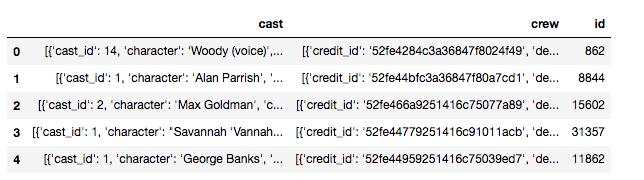

Building Content-Based Recommenders
===================================

In the previous lab, we built an IMDB Top 250 clone (a type of
simple recommender) and a knowledge-based recommender that suggested
movies based on timeline, genre, and duration. However, these systems
were extremely primitive. The simple recommender did not take into
consideration an individual user\'s preferences. The knowledge-based
recommender did take account of the user\'s preference for genres,
timelines, and duration, but the model and its recommendations still
remained very generic.

Imagine that Alice likes the movies *The Dark Knight,* *Iron Man*, and
*Man of Steel.* It is pretty evident that Alice has a taste for
superhero movies. However, our models from the previous lab would
not be able to capture this detail. The best it could do is suggest
*action* movies (by making Alice input *action* as the preferred genre),
which is a superset of superhero movies.

It is also possible that two movies have the same genre, timeline, and
duration characteristics, but differ hugely in their audience. Consider
*The* *Hangover* and *Forgetting Sarah Marshall,* for example. Both
these movies were released in the first decade of the 21st century, both
lasted around two hours, and both were comedies. However, the kind of
audience that enjoyed these movies was very different.

An obvious fix to this problem is to ask the user for more metadata as
input. For instance, if we introduced a *sub-genre* input, the user
would be able to input values such as *superhero, black comedy,* and
*romantic comedy,* and obtain more appropriate results, but this
solution suffers heavily from the perspective of usability.

The first problem is that we do not possess data on *sub-genres.*
Secondly, even if we did, our users are extremely unlikely to possess
knowledge of their favorite movies\' metadata. Finally, even if they
did, they would certainly not have the patience to input it into a long
form. Instead, what they would be more willing to do is tell you the
movies they like/dislike and expect recommendations that match their
tastes.

As we discussed in the first lab, this is exactly what sites like
Netflix do. When you sign up on Netflix for the first time, it doesn\'t
have any information about your tastes for it to build a profile,
leverage the power of its community, and give you recommendations with
(a concept we\'ll explore in later labs). Instead, what it does is
ask you for a few movies you like and show you results that are most
similar to those movies.

In this lab, we are going to build two types of content-based
recommender:

-   **Plot description-based recommender:** This model compares the
    descriptions and taglines of different movies, and provides
    recommendations that have the most similar plot descriptions.
-   **Metadata-based recommender:** This model takes a host of features,
    such as genres, keywords, cast, and crew, into consideration and
    provides recommendations that are the most similar with respect to
    the aforementioned features.


Exporting the clean DataFrame
=============================

In the previous lab, we performed a series of data wrangling and
cleaning processes on our metadata in order to convert it into a form
that was more usable. To avoid having to perform these steps again,
let\'s save this cleaned DataFrame into a CSV file. As always, doing
this with pandas happens to be extremely easy.

In the knowledge recommender notebook from Lab 4*,* enter the
following code in the last cell:


```
#Convert the cleaned (non-exploded) dataframe df into a CSV file and save it in the data folder
#Set parameter index to False as the index of the DataFrame has no inherent meaning.
df.to_csv('../data/metadata_clean.csv', index=False)
```


Your [data] folder should now contain a new file,
[metadata\_clean.csv].

Let\'s create a new folder, [Lab 4]*,* and open a new Jupyter
Notebook within this folder. Let\'s now import our new file into this
Notebook:


```
import pandas as pd
import numpy as np

#Import data from the clean file 
df = pd.read_csv('../data/metadata_clean.csv')

#Print the head of the cleaned DataFrame
df.head()
```


The cell should output a DataFrame that is already clean and in the
desired form.


Document vectors
================

Essentially, the models we are building compute the pairwise similarity
between bodies of text. But how do we numerically quantify the
similarity between two bodies of text?

To put it another way, consider three movies: A, B, and C. How can we
mathematically prove that the plot of A is more similar to the plot of B
than to that of C (or vice versa)?

The first step toward answering these questions is to represent the
bodies of text (henceforth referred to as documents) as mathematical
quantities. This is done by representing these documents as vectors*.*
In other words, every document is depicted as a series of *n* numbers,
where each number represents a dimension and *n* is the size of the
vocabulary of all the documents put together.

But what are the values of these vectors? The answer to that question
depends on the *vectorizer* we are using to convert our documents into
vectors. The two most popular vectorizers are CountVectorizer and
TF-IDFVectorizer*.*


CountVectorizer
===============

CountVectorizer is the simplest type of vectorizer and is best explained
with the help of an example. Imagine that we have three documents, A, B,
and C, which are as follows:

-   **A**: The sun is a star.
-   **B**: My love is like a red, red rose
-   **C**: Mary had a little lamb

We now have to convert these documents into their vector forms using
CountVectorizer. The first step is to compute the size of the
vocabulary. The vocabulary is the number of unique words present across
all documents. Therefore, the vocabulary for this set of three documents
is as follows: the, sun, is, a, star, my, love, like, red, rose, mary,
had, little, lamb. Consequently, the size of the vocabulary is 14.

It is common practice to not include extremely common words such as a,
the, is, had, my, and so on (also known as stop words) in the
vocabulary. Therefore, eliminating the stop words, our vocabulary, *V,*
is as follows:

**V**: like, little, lamb, love, mary, red, rose, sun, star

The size of our vocabulary is now nine. Therefore, our documents will be
represented as nine-dimensional vectors, and each dimension here will
represent the number of times a particular word occurs in a document. In
other words, the first dimension will represent the number of times like
occurs, the second will represent the number of times little occurs, and
so on.

Therefore, using the CountVectorizer approach, A, B, and C will now be
represented as follows:

-   **A**: (0, 0, 0, 0, 0, 0, 0, 1, 1)
-   **B**: (1, 0, 0, 1, 0, 2, 1, 0, 0)
-   **C**: (0, 1, 1, 0, 1, 0, 0, 0, 0)


TF-IDFVectorizer
================

Not all words in a document carry equal weight. We already observed this
when we eliminated the stop words from our vocabulary altogether. But
the words that were in the vocabulary were all given equal weighting.

But should this always be the case?

For example, consider a corpus of documents on dogs. Now, it is obvious
that all these documents will frequently contain the word dog.
Therefore, the appearance of the word *dog* isn\'t as important as
another word that only appears in a few documents.

**TF-IDFVectorizer** (**Term Frequency-Inverse Document
Frequency**)takes the aforementioned point into consideration and
assigns weights to each word according to the following formula. For
every word *i* in document *j*, the following applies:


In this formula, the following is true:

-   *w*~*i,\ j*~ is the weight of word *i* in document *j\
    *
-   *df~i~* is the number of documents that contain the term *i\
    *
-   *N* is the total number of documents

We won\'t go too much into the formula and the associated calculations.
Just keep in mind that the weight of a word in a document is greater if
it occurs more frequently in that document and is present in fewer
documents. The weight *w*~*i,j*~ takes values between [0] and
[1]:


We will be using TF-IDFVectorizer because some words (pictured in the
preceding word cloud) occur much more frequently in plot descriptions
than others. It is therefore a good idea to assign weights to each word
in a document according to the TF-IDF formula.

Another reason to use TF-IDF is that it speeds up the calculation of the
cosine similarity score between a pair of documents. We will discuss
this point in greater detail when we implement this in code.


The cosine similarity score
===========================

We will discuss similarity scores in detail in Lab 5,
*Getting Started with Data Mining Techniques*. Presently, we will make
use of the *cosine similarity* metric to build our models. The cosine
score is extremely robust and easy to calculate (especially when used in
conjunction with TF-IDFVectorizer).

The cosine similarity score between two documents, *x* and *y,* is as
follows:


The cosine score can take any value between -1 and 1. The higher the
cosine score, the more similar the documents are to each other. We now
have a good theoretical base to proceed to build the content-based
recommenders using Python.


Plot description-based recommender
==================================

Our plot description-based recommender will take in a movie title as an
argument and output a list of movies that are most similar based on
their plots. These are the steps we are going to perform in building
this model:

1.  Obtain the data required to build the model
2.  Create TF-IDF vectors for the plot description (or overview) of
    every movie
3.  Compute the pairwise cosine similarity score of every movie
4.  Write the recommender function that takes in a movie title as an
    argument and outputs movies most similar to it based on the plot


Preparing the data
==================

In its present form, the DataFrame, although clean, does not contain the
features that are required to build the plot description-based
recommender. Fortunately, these requisite features are available in the
original metadata file.

All we have to do is import them and add them to our DataFrame:


```
#Import the original file
orig_df = pd.read_csv('../data/movies_metadata.csv', low_memory=False)

#Add the useful features into the cleaned dataframe
df['overview'], df['id'] = orig_df['overview'], orig_df['id']

df.head()
```


The DataFrame should now contain two new features: [overview] and
[id]. We will use [overview] in building this model and
[id] for building the next.

The [overview] feature consists of strings and, ideally, we should
clean them up by removing all punctuation and converting all the words
to lowercase. However, as we will see shortly, all this will be done for
us automatically by [scikit-learn]*,* the library we\'re going to
use heavily in building the models in this lab.


Creating the TF-IDF matrix
==========================

The next step is to create a DataFrame where each row represents the
TF-IDF vector of the [overview] feature of the corresponding movie
in our main DataFrame. To do this, we will use the [scikit-learn]
library, which gives us access to a TfidfVectorizer object to perform
this process effortlessly:


```
#Import TfIdfVectorizer from the scikit-learn library
from sklearn.feature_extraction.text import TfidfVectorizer

#Define a TF-IDF Vectorizer Object. Remove all english stopwords
tfidf = TfidfVectorizer(stop_words='english')

#Replace NaN with an empty string
df['overview'] = df['overview'].fillna('')

#Construct the required TF-IDF matrix by applying the fit_transform method on the overview feature
tfidf_matrix = tfidf.fit_transform(df['overview'])

#Output the shape of tfidf_matrix
tfidf_matrix.shape

OUTPUT:
(45466, 75827)
```


We see that the vectorizer has created a 75,827-dimensional vector for
the overview of every movie.


Computing the cosine similarity score
=====================================

The next step is to calculate the pairwise cosine similarity score of
every movie. In other words, we are going to create a 45,466 × 45,466
matrix, where the cell in the *i^th^* row and *j^th^* column represents
the similarity score between movies *i* and *j.* We can easily see that
this matrix is symmetric in nature and every element in the diagonal is
1, since it is the similarity score of the movie with itself.

Like TF-IDFVectorizer, [scikit-learn] also has functionality for
computing the aforementioned similarity matrix. Calculating the cosine
similarity is, however, a computationally expensive process.
Fortunately, since our movie plots are represented as TF-IDF vectors,
their magnitude is always 1. Hence, we do not need to calculate the
denominator in the cosine similarity formula as it will always be 1. Our
work is now reduced to computing the much simpler and computationally
cheaper dot product (a functionality that is also provided by
[scikit-learn]):


```
# Import linear_kernel to compute the dot product
from sklearn.metrics.pairwise import linear_kernel

# Compute the cosine similarity matrix
cosine_sim = linear_kernel(tfidf_matrix, tfidf_matrix)
```


Although we\'re computing the cheaper dot product, the process will
still take a few minutes to complete. With the similarity scores of
every movie with every other movie, we are now in a very good position
to write our final recommender function.


Building the recommender function
=================================

The final step is to create our recommender function. However, before we
do that, let\'s create a reverse mapping of movie titles and their
respective indices. In other words, let\'s create a pandas series with
the index as the movie title and the value as the corresponding index in
the main DataFrame:


```
#Construct a reverse mapping of indices and movie titles, and drop duplicate titles, if any
indices = pd.Series(df.index, index=df['title']).drop_duplicates()
```


We will perform the following steps in building the recommender
function:

1.  Declare the title of the movie as an argument.
2.  Obtain the index of the movie from the [indices] reverse
    mapping.
3.  Get the list of cosine similarity scores for that particular movie
    with all movies using [cosine\_sim]. Convert this into a list
    of tuples where the first element is the position and the second is
    the similarity score.
4.  Sort this list of tuples on the basis of the cosine similarity
    scores.
5.  Get the top 10 elements of this list. Ignore the first element as it
    refers to the similarity score with itself (the movie most similar
    to a particular movie is obviously the movie itself).
6.  Return the titles corresponding to the indices of the top 10
    elements, excluding the first:


```
# Function that takes in movie title as input and gives recommendations 
def content_recommender(title, cosine_sim=cosine_sim, df=df, indices=indices):
    # Obtain the index of the movie that matches the title
    idx = indices[title]

    # Get the pairwsie similarity scores of all movies with that movie
    # And convert it into a list of tuples as described above
    sim_scores = list(enumerate(cosine_sim[idx]))

    # Sort the movies based on the cosine similarity scores
    sim_scores = sorted(sim_scores, key=lambda x: x[1], reverse=True)

    # Get the scores of the 10 most similar movies. Ignore the first movie.
    sim_scores = sim_scores[1:11]

    # Get the movie indices
    movie_indices = [i[0] for i in sim_scores]

    # Return the top 10 most similar movies
    return df['title'].iloc[movie_indices]
```


Congratulations! You\'ve built your very first content-based
recommender. Now it is time to see our recommender in action! Let\'s ask
it for recommendations of movies similar to [The Lion King]*:*


```
#Get recommendations for The Lion King
content_recommender('The Lion King')
```


We see that our recommender has suggested all of *The Lion King\'s*
sequels in its top-10 list. We also notice that most of the movies in
the list have to do with lions.

It goes without saying that a person who loves *The Lion King* is very
likely to have a thing for Disney movies. They may also prefer to watch
animated movies. Unfortunately, our plot description recommender isn\'t
able to capture all this information.

Therefore, in the next section, we will build a recommender that uses
more advanced metadata, such as genres, cast, crew, and keywords (or
sub-genres). This recommender will be able to do a much better job of
identifying an individual\'s taste for a particular director, actor,
sub-genre, and so on.


Metadata-based recommender
==========================

We will largely follow the same steps as the plot description-based
recommender to build our metadata-based model. The main difference, of
course, is in the type of data we use to build the model.


Preparing the data
==================

To build this model, we will be using the following metdata:

-   The genre of the movie.
-   The director of the movie. This person is part of the crew.
-   The movie\'s three major stars. They are part of the cast.
-   Sub-genres or keywords.

With the exception of genres, our DataFrames (both original and cleaned)
do not contain the data that we require. Therefore, for this exercise,
we will need to download two additional files: [credits.csv]*,*
which contains information on the cast and crew of the movies, and
[keywords.csv]*,* which contains information on the sub-genres.


You can download the necessary files from the following URL:
<https://www.kaggle.com/rounakbanik/the-movies-dataset/data>.


Place both files in your [data] folder. We need to perform a good
amount of wrangling before the data is converted into a form that is
usable. Let\'s begin!


The keywords and credits datasets
=================================

Let\'s start by loading our new data into the existing Jupyter Notebook:


```
# Load the keywords and credits files
cred_df = pd.read_csv('../data/credits.csv')
key_df = pd.read_csv('../data/keywords.csv')

#Print the head of the credit dataframe
cred_df.head()
```





```
#Print the head of the keywords dataframe
key_df.head()
```


We can see that the cast, crew, and the keywords are in the familiar
[list of dictionaries] form. Just like [genres]*,* we have
to reduce them to a string or a list of strings.

Before we do this, however, we will join the three DataFrames so that
all our features are in a single DataFrame. Joining pandas DataFrames is
identical to joining tables in SQL. The key we\'re going to use to join
the DataFrames is the [id] feature. However, in order to use this,
we first need to explicitly convert is listed as an ID. This is clearly
bad data. Therefore, we should fin
into an integer. We already know how to do this:


```
#Convert the IDs of df into int
df['id'] = df['id'].astype('int')
```


Running the preceding code results in a [ValueError]. On closer
inspection, we see that *1997-08-20* is listed as an ID. This is clearly
bad data. Therefore, we should find all the rows with bad IDs and remove
them in order for the code execution to be successful:


```
# Function to convert all non-integer IDs to NaN
def clean_ids(x):
    try:
        return int(x)
    except:
        return np.nan

#Clean the ids of df
df['id'] = df['id'].apply(clean_ids)

#Filter all rows that have a null ID
df = df[df['id'].notnull()]
```


We are now in a good position to convert the IDs of all three DataFrames
into integers and merge them into a single DataFrame:


```
# Convert IDs into integer
df['id'] = df['id'].astype('int')
key_df['id'] = key_df['id'].astype('int')
cred_df['id'] = cred_df['id'].astype('int')

# Merge keywords and credits into your main metadata dataframe
df = df.merge(cred_df, on='id')
df = df.merge(key_df, on='id')

#Display the head of the merged df
df.head()
```


Wrangling keywords, cast, and crew
==================================

Now that we have all the desired features in a single DataFrame, let\'s
convert them into a form that is more usable. More specifically, these
are the transformations we will be looking to perform:

-   Convert [keywords] into a list of strings where each string is
    a keyword (similar to genres). We will include only the top three
    keywords. Therefore, this list can have a maximum of three elements.
-   Convert [cast] into a list of strings where each string is a
    star. Like [keywords]*,* we will only include the top three
    stars in our cast.
-   Convert [crew] into [director]*.* In other words, we
    will extract only the director of the movie and ignore all other
    crew members.

The first step is to convert these stringified objects into native
Python objects:


```
# Convert the stringified objects into the native python objects
from ast import literal_eval

features = ['cast', 'crew', 'keywords', 'genres']
for feature in features:
    df[feature] = df[feature].apply(literal_eval)
```


Next, let\'s extract the director from our [crew] list. To do
this, we will first examine the structure of the dictionary in the
[crew] list:


```
#Print the first cast member of the first movie in df
df.iloc[0]['crew'][0]

OUTPUT:
{'credit_id': '52fe4284c3a36847f8024f49',
 'department': 'Directing',
 'gender': 2,
 'id': 7879,
 'job': 'Director',
 'name': 'John Lasseter',
 'profile_path': '/7EdqiNbr4FRjIhKHyPPdFfEEEFG.jpg'}
```


We see that this dictionary consists of [job] and [name]
keys. Since we\'re only interested in the director, we will loop through
all the crew members in a particular list and extract the [name]
when the [job] is [Director]. Let\'s write a function that
does this:


```
# Extract the director's name. If director is not listed, return NaN
def get_director(x):
    for crew_member in x:
        if crew_member['job'] == 'Director':
            return crew_member['name']
    return np.nan


```


Now that we have the [get\_director] function, we can define the
new [director] feature:


```
#Define the new director feature
df['director'] = df['crew'].apply(get_director)

#Print the directors of the first five movies
df['director'].head()

OUTPUT:
0 John Lasseter
1 Joe Johnston
2 Howard Deutch
3 Forest Whitaker
4 Charles Shyer
Name: director, dtype: object
```


Both [keywords] and [cast] are dictionary lists as well.
And, in both cases, we need to extract the top three [name]
attributes of each list. Therefore, we can write a single function to
wrangle both these features. Also, just like [keywords] and
[cast]*,* we will only consider the top three genres for every
movie:


```
# Returns the list top 3 elements or entire list; whichever is more.
def generate_list(x):
    if isinstance(x, list):
        names = [ele['name'] for ele in x]
        #Check if more than 3 elements exist. If yes, return only first three. 
        #If no, return entire list.
        if len(names) > 3:
            names = names[:3]
        return names

    #Return empty list in case of missing/malformed data
    return []
```


We will use this function to wrangle our [cast] and
[keywords] features. We will also only consider the first three
[genres] listed:


```
#Apply the generate_list function to cast and keywords
df['cast'] = df['cast'].apply(generate_list)
df['keywords'] = df['keywords'].apply(generate_list)

#Only consider a maximum of 3 genres
df['genres'] = df['genres'].apply(lambda x: x[:3])
```


Let\'s now take a look at a sample of our wrangled data:


```
# Print the new features of the first 5 movies along with title
df[['title', 'cast', 'director', 'keywords', 'genres']].head(3)
```


In the subsequent steps, we are going to use a vectorizer to build
document vectors. If two actors had the same first name (say, Ryan
Reynolds and Ryan Gosling), the vectorizer will treat both Ryans as the
same, although they are clearly different entities. This will impact the
quality of the recommendations we receive. If a person likes Ryan
Reynolds\' movies, it doesn\'t imply that they like movies by all Ryans.

Therefore, the last step is to strip the spaces between keywords, and
actor and director names, and convert them all into lowercase.
Therefore, the two Ryans in the preceding example will become
*ryangosling* and *ryanreynolds*, and our vectorizer will now be able to
distinguish between them:


```
# Function to sanitize data to prevent ambiguity. 
# Removes spaces and converts to lowercase
def sanitize(x):
    if isinstance(x, list):
        #Strip spaces and convert to lowercase
        return [str.lower(i.replace(" ", "")) for i in x]
    else:
        #Check if director exists. If not, return empty string
        if isinstance(x, str):
            return str.lower(x.replace(" ", ""))
        else:
            return ''
#Apply the generate_list function to cast, keywords, director and genres
for feature in ['cast', 'director', 'genres', 'keywords']:
    df[feature] = df[feature].apply(sanitize)
```


Creating the metadata soup
==========================

In the plot description-based recommender, we worked with a single
*overview* feature, which was a body of text. Therefore, we were able to
apply our vectorizer directly.

However, this is not the case with our metadata-based recommender. We
have four features to work with, of which three are lists and one is a
string. What we need to do is create a [soup] that contains the
actors, director, keywords, and genres. This way, we can feed this soup
into our vectorizer and perform similar follow-up steps to before:


```
#Function that creates a soup out of the desired metadata
def create_soup(x):
    return ' '.join(x['keywords']) + ' ' + ' '.join(x['cast']) + ' ' + x['director'] + ' ' + ' '.join(x['genres'])
```


With this function in hand, we create the [soup] feature:


```
# Create the new soup feature
df['soup'] = df.apply(create_soup, axis=1)
```


Let\'s now take a look at one of the [soup] values. It should be a
string containing words that represent genres, cast, and keywords:


```
#Display the soup of the first movie
df.iloc[0]['soup']

OUTPUT:
'jealousy toy boy tomhanks timallen donrickles johnlasseter animation comedy family'
```


With the [soup] created, we are now in a good position to create
our document vectors, compute similarity scores, and build the
metadata-based recommender function.


Generating the recommendations
==============================

The next steps are almost identical to the corresponding steps from the
previous section.

Instead of using TF-IDFVectorizer, we will be using CountVectorizer.
This is because using TF-IDFVectorizer will accord less weight to actors
and directors who have acted and directed in a relatively larger number
of movies.

This is not desirable, as we do not want to penalize artists for
directing or appearing in more movies:


```
#Define a new CountVectorizer object and create vectors for the soup
count = CountVectorizer(stop_words='english')
count_matrix = count.fit_transform(df['soup'])
```


Unfortunately, using CountVectorizer means that we are forced to use the
more computationally expensive [cosine\_similarity] function to
compute our scores:


```
#Import cosine_similarity function
from sklearn.metrics.pairwise import cosine_similarity

#Compute the cosine similarity score (equivalent to dot product for tf-idf vectors)
cosine_sim2 = cosine_similarity(count_matrix, count_matrix)
```


Since we dropped a few movies with bad indices, we need to construct our
reverse mapping again. Let\'s do that as the next step:


```
# Reset index of your df and construct reverse mapping again
df = df.reset_index()
indices2 = pd.Series(df.index, index=df['title'])
```


With the new reverse mapping constructed and the similarity scores
computed, we can reuse the [content\_recommender] function defined
in the previous section by passing in [cosine\_sim2] as an
argument. Let\'s now try out our new model by asking recommendations for
the same movie, [The Lion King]*:*


```
content_recommender('The Lion King', cosine_sim2, df, indices2)
```


The recommendations given in this case are vastly different to the ones
that our plot description-based recommender gave. We see that it has
been able to capture more information than just lions. Most of the
movies in the list are animated and feature anthropomorphic characters.

Personally, I found the *Pokemon: Arceus and the Jewel of Life*
recommendation especially interesting. Both this movie and *The Lion
King* feature cartoon anthropomorphic characters who return after a few
years to exact revenge on those who had wronged them.


Suggestions for improvements
============================

The content-based recommenders we\'ve built in this lab are, of
course, nowhere near the powerful models used in the industry. There is
still plenty of scope for improvement. In this section, I will suggest a
few ideas for upgrading the recommenders that you\'ve already built:

-   **Experiment with the number of keywords, genres, and cast**: In the
    model that we built, we considered at most three keywords, genres,
    and actors for our movies. This was, however, an arbitrary decision.
    It is a good idea to experiment with the number of these features in
    order to be considered for the metadata soup.

-   **Come up with more well-defined sub-genres**: Our model only
    considered the first three keywords that appeared in the keywords
    list. There was, however, no justification for doing so. In fact, it
    is entirely possible that certain keywords appeared in only one
    movie (thus rendering them useless). A much more potent technique
    would be to define, as with the genres, a definite number of
    sub-genres and assign only these sub-genres to the movies.

-   **Give more weight to the director**: Our model gave as much
    importance to the director as to the actors. However, you can argue
    that the character of a movie is determined more by the former. We
    can give more emphasis to the director by mentioning this individual
    multiple times in our soup instead of just once. Experiment with the
    number of repetitions of the director in the soup.

-   **Consider other members of the crew**: The director isn\'t the only
    person that gives the movie its character. You can also consider
    adding other crew members, such as producers and screenwriters, to
    your soup.

-   **Experiment with other metadata**: We only considered genres,
    keywords, and credits while building our metadata model. However,
    our dataset contains plenty of other features, such as production
    companies, countries, and languages. You may consider these data
    points, too, as they may be able to capture important information
    (such as if two movies are produced by *Pixar).*

-   **Introduce a popularity filter**: It is entirely possible that two
    movies have the same genres and sub-genres, but differ wildly in
    quality and popularity. In such cases, you may want to introduce a
    popularity filter that considers the *n* most similar movies,
    computes a weighted rating, and displays the top five results. You
    have already learned how to do this in the previous lab.


Summary
=======

We have come a long way in this lab. We first learned about document
vectors and gained a brief introduction to the cosine similarity score.
Next, we built a recommender that identified movies with similar plot
descriptions. We then proceeded to build a more advanced model that
leveraged the power of other metadata, such as genres, keywords, and
credits. Finally, we discussed a few methods by which we could improve
our existing system.

With this, we formally come to an end of our tour of content-based
recommendation system. In the next labs, we will cover what is
arguably the most popular recommendation model in the industry today:
collaborative filtering.
