Lab 5: Getting Started with Data Mining Techniques
==================================================

In 2003, Linden, Smith, and York of Amazon.com published a paper
entitled Item-to-Item Collaborative Filtering, which explained how
product recommendations at Amazon work. Since then, this class of
algorithmg has gone on to dominate the industry standard for
recommendations. Every website or app with a sizeable user base, be it
Netflix, Amazon, or Facebook, makes use of some form of collaborative
filters to suggest items (which may be movies, products, or friends):


We will be building powerful collaborative filters in the next lab.
However, before we do that, it is important that we have a good grasp of
the underlying techniques, principles, and algorithms that go into
building collaborative filters.

Therefore, in this lab, we will cover the following topics:

- Similarity measures
- Dimensionality reduction
- Supervised learning
- Clustering
- Evaluation methods and metrics

The topics covered in this lab merit an entire textbook. Since this
is a hands-on recommendation engine tutorial, we will not be delving too
deeply into the functioning of most of the algorithms. Nor will we code
them up from scratch. What we will do is gain an understanding of how
and when they work, their advantages and disadvantages, and their
easy-to-use implementations using the scikit-learn library.


Problem statement
=================

Collaborative filtering algorithms try to solve the prediction problem
(as described in the Lab 1,
*Getting Started with Recommender Systems*). In other words, we are
given a matrix of i users and j items. The value in the ith row and the
jth column (denoted by rij) denotes the rating given by user i to item
j:


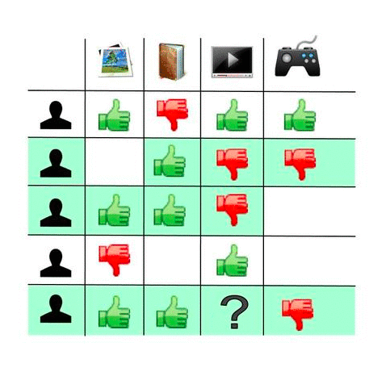

**Matrix of i users and j items**

Our job is to complete this matrix. In other words, we need to predict
all the cells in the matrix that we have no data for. For example, in
the preceding diagram, we are asked to predict whether user E will like
the music player item. To accomplish this task, some ratings are
available (such as User A liking the music player and video games)
whereas others are not (for instance, we do not know whether Users C and D like video games).


Euclidean distance
==================

Euclidean scores can take any value between 0 and infinity. The lower
the Euclidean score (or distance), the more similar the two vectors are
to each other. Let\'s now define a simple function using NumPy, which
allows us to compute the Euclidean distance between two *n*-dimensional
vectors using the aforementioned formula:


```
#Function to compute Euclidean Distance. 
def euclidean(v1, v2):
    
    #Convert 1-D Python lists to numpy vectors
    v1 = np.array(v1)
    v2 = np.array(v2)
    
    #Compute vector which is the element wise square of the difference
    diff = np.power(np.array(v1)- np.array(v2), 2)
    
    #Perform summation of the elements of the above vector
    sigma_val = np.sum(diff)
    
    #Compute square root and return final Euclidean score
    euclid_score = np.sqrt(sigma_val)
    
    return euclid_score
```


Next, let\'s define three users who have rated five different movies:


```
#Define 3 users with ratings for 5 movies
u1 = [5,1,2,4,5]
u2 = [1,5,4,2,1]
u3 = [5,2,2,4,4]
```


From the ratings, we can see that users 1 and 2 have extremely different
tastes, whereas the tastes of users 1 and 3 are largely similar. Let\'s
see whether the Euclidean distance metric is able to capture this:


```
euclidean(u1, u2)

OUTPUT:
7.4833147735478827
```


The Euclidean distance between users 1 and 2 comes out to be
approximately 7.48:


```
euclidean(u1, u3)

OUTPUT:
1.4142135623730951
```


Users 1 and 3 have a much smaller Euclidean score between them than
users 1 and 2. Therefore, in this case, the Euclidean distance was able
to satisfactorily capture the relationships between our users.


Pearson correlation
===================

Consider two users, Alice and Bob, who have rated the same five movies.
Alice is extremely stingy with her ratings and never gives more than a 4
to any movie. On the other hand, Bob is more liberal and never gives
anything below a 2 when rating movies. Let\'s define the matrices
representing Alice and Bob and compute their Euclidean distance:


```
alice = [1,1,3,2,4]
bob = [2,2,4,3,5]

euclidean(alice, bob)

OUTPUT:
2.2360679774997898
```


We get a Euclidean distance of about 2.23. However, on closer
inspection, we see that Bob always gives a rating that is one higher
than Alice. Therefore, we can say that Alice and Bob\'s ratings are
extremely correlated. In other words, if we know Alice\'s rating for a
movie, we can compute Bob\'s rating for the same movie with high
accuracy (in this case, by just adding 1).

Consider another user, Eve, who has the polar opposite tastes to Alice:


```
eve = [5,5,3,4,2]

euclidean(eve, alice)

OUTPUT:
6.324555320336759
```


A high Euclidean distance of 6.32 between Alice and Eve suggests they're very dissimilar. However, their ratings always add up to 6, indicating a strong negative correlation, where one person's rating can predict the other's. 

Euclidean distances focus on magnitude, making it hard to assess similarity or dissimilarity accurately. The **Pearson correlation** addresses this by scoring similarity between -1 and 1. A score of -1 indicates strong negative correlation (like Alice and Eve), 1 indicates strong positive correlation (like Alice and Bob), and 0 means no correlation.


The SciPy package gives us access to a function that computes the
Pearson Similarity Scores:


```
from scipy.stats import pearsonr

pearsonr(alice, bob)

OUTPUT:
(1.0, 0.0)
pearsonr(alice, eve)

OUTPUT:
(-1.0, 0.0)
```


The first element of our list output is the Pearson score. We see that
Alice and Bob have the highest possible similarity score, whereas Alice
and Eve have the lowest possible score.

Can you guess the similarity score for Bob and Eve?


Clustering
==========


Clustering is one of the most popular techniques used in
collaborative-filtering algorithms. It is a type of unsupervised
learning that groups data points into different classes in such a way
that data points belonging to a particular class are more similar to
each other than data points belonging to different classes:


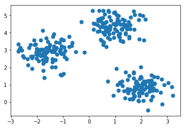


k-means clustering
==================

The k-means algorithm is one of the simplest yet most popular machine
learning algorithms. It takes in the data points and the number of
clusters (k) as input.

Next, it randomly plots k different points on the plane (called
centroids). After the k centroids are randomly plotted, the following
two steps are repeatedly performed until there is no further change in
the set of k centroids:

-   Assignment of points to the centroids: Every data point is assigned
    to the centroid that is the closest to it. The collection of data
    points assigned to a particular centroid is called a cluster.
    Therefore, the assignment of points to k centroids results in the
    formation of k clusters.
-   Reassignment of centroids: In the next step, the centroid of every
    cluster is recomputed to be the center of the cluster (or the
    average of all the points in the cluster). All the data points are
    then reassigned to the new centroids:


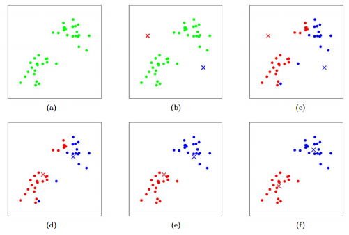


The preceding screenshot shows a visualization of the steps involved in
a k-means clustering algorithm, with the number of assigned clusters as
two.


We will not be implementing the k-means algorithm from scratch. Instead,
we will use its implementation provided by scikit-learn. As a first
step, let\'s access the data points as plotted in the beginning of this
section:


```
#Import the function that enables us to plot clusters
from sklearn.datasets.samples_generator import make_blobs

#Get points such that they form 3 visually separable clusters
X, y = make_blobs(n_samples=300, centers=3,
                       cluster_std=0.50, random_state=0)


#Plot the points on a scatterplot
plt.scatter(X[:, 0], X[:, 1], s=50)
```


One of the most important steps while using the k-means algorithm is
determining the number of clusters. In this case, it can be clearly seen
from the plot (and the code) that we\'ve plotted the points in such a
way that they form three clearly separable clusters. Let\'s now apply
the k-means algorithm via scikit-learn and assess its performance:


```
#Import the K-Means Class
from sklearn.cluster import KMeans

#Initializr the K-Means object. Set number of clusters to 3, 
#centroid initilalization as 'random' and maximum iterations to 10
kmeans = KMeans(n_clusters=3, init='random', max_iter=10)

#Compute the K-Means clustering 
kmeans.fit(X)

#Predict the classes for every point
y_pred = kmeans.predict(X)

#Plot the data points again but with different colors for different classes
plt.scatter(X[:, 0], X[:, 1], c=y_pred, s=50)

#Get the list of the final centroids
centroids = kmeans.cluster_centers_

#Plot the centroids onto the same scatterplot.
plt.scatter(centroids[:, 0], centroids[:, 1], c='black', s=100, marker='X')
```


We see that the algorithm proves to be extremely successful in
identifying the three clusters. The three final centroids are also
marked with an X on the plot:


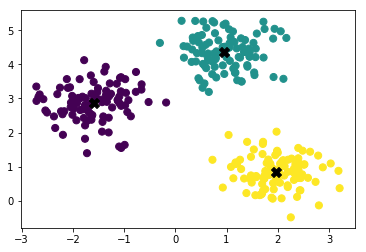


Choosing k
==========

Scikit-learn\'s implementation of k-means
automatically computes the value of sum-of-squares when it is computing
the clusters. Let\'s now visualize the Elbow plot for our data and
determine the best value of K:


```
#List that will hold the sum of square values for different cluster sizes
ss = []

#We will compute SS for cluster sizes between 1 and 8.
for i in range(1,9):
    
    #Initialize the KMeans object and call the fit method to compute clusters 
    kmeans = KMeans(n_clusters=i, random_state=0, max_iter=10, init='random').fit(X)
    
    #Append the value of SS for a particular iteration into the ss list
    ss.append(kmeans.inertia_)

#Plot the Elbow Plot of SS v/s K
sns.pointplot(x=[j for j in range(1,9)], y=ss)
```


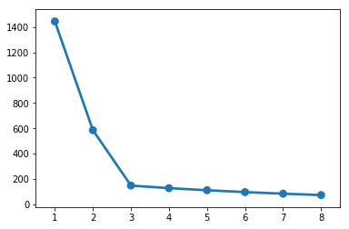


From the plot, it is clear that the Elbow is at K=3. From what we
visualized earlier, we know that this is indeed the optimum number of
clusters for this data.


Other clustering algorithms
===========================

The k-means algorithm, although very powerful, is not ideal for every
use case.

To illustrate, let\'s construct a plot with two half moons. Like the
preceding blobs, scikit-learn gives us a convenient function to plot
half-moon clusters:


```
#Import the half moon function from scikit-learn
from sklearn.datasets import make_moons

#Get access to points using the make_moons function
X_m, y_m = make_moons(200, noise=.05, random_state=0)

#Plot the two half moon clusters
plt.scatter(X_m[:, 0], X_m[:, 1], s=50)
```


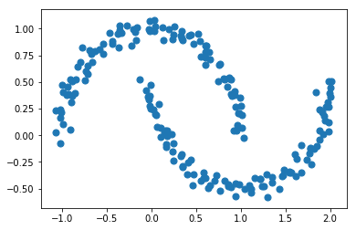


Will the k-means algorithm be able to figure out the two half moons
correctly? Let\'s find out:


```
#Initialize K-Means Object with K=2 (for two half moons) and fit it to our data
kmm = KMeans(n_clusters=2, init='random', max_iter=10)
kmm.fit(X_m)

#Predict the classes for the data points
y_m_pred = kmm.predict(X_m)

#Plot the colored clusters as identified by K-Means
plt.scatter(X_m[:, 0], X_m[:, 1], c=y_m_pred, s=50)
```


Let\'s now visualize what k-means thinks the two clusters that exist for
this set of data points are:


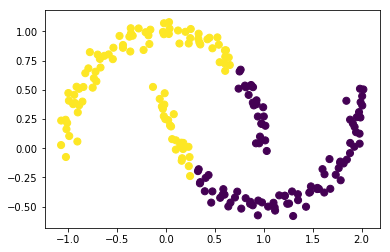


We see that the k-means algorithm doesn\'t do a very good job of
identifying the correct clusters. For clusters such as these half moons,
another algorithm, called spectral clustering, with nearest-neighbor,
affinity performs much better.

We will not go into the workings of spectral clustering. Instead, we
will use its scikit-learn implementation and assess its performance
directly:


```
#Import Spectral Clustering from scikit-learn
from sklearn.cluster import SpectralClustering

#Define the Spectral Clustering Model
model = SpectralClustering(n_clusters=2, affinity='nearest_neighbors')

#Fit and predict the labels
y_m_sc = model.fit_predict(X_m)

#Plot the colored clusters as identified by Spectral Clustering
plt.scatter(X_m[:, 0], X_m[:, 1], c=y_m_sc, s=50)
```


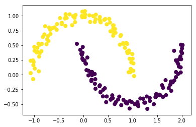


We see that spectral clustering does a very good job of identifying the
half-moon clusters.

We have seen that different clustering algorithms are appropriate in
different cases. The same applies to cases of collaborative filters. For
instance, the surprise package, which we will visit in the next lab,
has an implementation of a collaborative filter that makes use of yet
another clustering algorithm, called co-clustering. We will wrap up our
discussion of clustering and move on to another important data mining
technique: dimensionality reduction.


Dimensionality reduction
========================

Most machine learning algorithms tend to perform poorly as the number of
dimensions in the data increases. This phenomenon is often known as the
curse of dimensionality. Therefore, it is a good idea to reduce the
number of features available in the data, while retaining the maximum
amount of information possible. There are two ways to achieve this:

- Feature selection
- Feature extraction

In this section, we will take a look at an important feature-extraction
method: **Principal component analysis** (or **PCA**).


Principal component analysis
============================

Understanding the PCA algorithm requires linear algebraic concepts that
are beyond the scope of this course. Instead, we will use the black box
implementation of PCA that [scikit-learn] gives us and consider a
use case with the well-known Iris dataset.

The first step is to load the Iris dataset from the UCI machine learning
repository into a pandas DataFrame:


```
# Load the Iris dataset into Pandas DataFrame
iris = pd.read_csv("https://archive.ics.uci.edu/ml/machine-learning-databases/iris/iris.data", 
                 names=['sepal_length','sepal_width','petal_length','petal_width','class'])

#Display the head of the dataframe
iris.head()
```


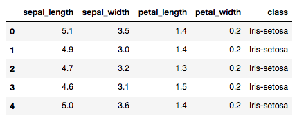


The PCA algorithm is extremely sensitive to scale. Therefore, we are
going to scale all the features in such a way that they have a mean of 0
and a variance of 1:


```
#Import Standard Scaler from scikit-learn
from sklearn.preprocessing import StandardScaler

#Separate the features and the class
X = iris.drop('class', axis=1)
y = iris['class']

# Scale the features of X
X = pd.DataFrame(StandardScaler().fit_transform(X), 
                 columns = ['sepal_length','sepal_width','petal_length','petal_width'])

X.head()
```


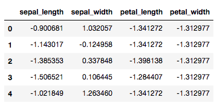


We\'re now in a good place to apply the PCA algorithm. Let\'s transform
our data into the two-dimensional space:


```
#Import PCA
from sklearn.decomposition import PCA

#Intialize a PCA object to transform into the 2D Space.
pca = PCA(n_components=2)

#Apply PCA
pca_iris = pca.fit_transform(X)
pca_iris = pd.DataFrame(data = pca_iris, columns = ['PC1', 'PC2'])

pca_iris.head()
```


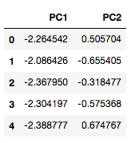


The [scikit-Learn]\'s PCA implementation also gives us information
about the ratio of variance contained by each principal component:


```
pca.explained_variance_ratio

OUTPUT:
array([ 0.72770452, 0.23030523])

```


We see that the first principal component holds about 72.8% of the
information, whereas the second principal component holds about 23.3%.
In total, 95.8% of the information is retained, whereas 4.2% of the
information is lost in removing two dimensions.

Finally, let\'s visualize our data points by class in the new 2D plane:


```
#Concatenate the class variable
pca_iris = pd.concat([pca_iris, y], axis = 1)

#Display the scatterplot
sns.lmplot(x='PC1', y='PC2', data=pca_iris, hue='class', fit_reg=False)
```


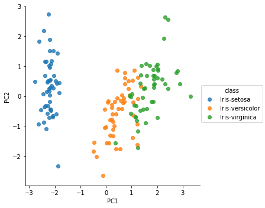


Other dimensionality reduction techniques
=========================================


Linear-discriminant analysis
============================

Like PCA, linear-discriminant analysis is a linear transformation method
that aims to transform *m*-dimensional data into an *n*-dimensional
output space.

However, unlike PCA, which tries to retain the maximum information, LDA
aims to identify a set of *n* features that result in the maximum
separation (or discrimination) of classes. Since LDA requires labeled
data in order to determine its components, it is a type of supervised
learning algorithm.

Let\'s now apply the LDA algorithm to the Iris dataset:


```
#Import LDA
from sklearn.discriminant_analysis import LinearDiscriminantAnalysis

#Define the LDA Object to have two components
lda = LinearDiscriminantAnalysis(n_components = 2)

#Apply LDA
lda_iris = lda.fit_transform(X, y)
lda_iris = pd.DataFrame(data = lda_iris, columns = ['C1', 'C2'])

#Concatenate the class variable
lda_iris = pd.concat([lda_iris, y], axis = 1)

#Display the scatterplot
sns.lmplot(x='C1', y='C2', data=lda_iris, hue='class', fit_reg=False)

```


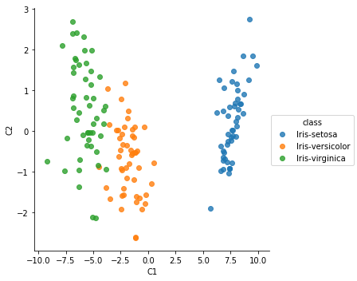

We see that the classes are much more separable than in PCA.


Supervised learning
===================

Supervised learning is a class of machine learning algorithm that takes
in a series of vectors and their corresponding output (a continuous
value or a class) as input, and produces an inferred function that can
be used to map new examples.


Boosting
========

The [scikit-learn] gives us access to implementations of all the
algorithms described in this section. The usage of every algorithm is
almost the same. As an illustration, let\'s apply gradient boosting to
classify the Iris dataset:


```
#Divide the dataset into the feature dataframe and the target class series.
X, y = iris.drop('class', axis=1), iris['class']

#Split the data into training and test datasets. 
#We will train on 75% of the data and assess our performance on 25% of the data

#Import the splitting function
from sklearn.model_selection import train_test_split

#Split the data into training and test sets
X_train, X_test, y_train, y_test = train_test_split(X, y, test_size=0.25, random_state=0)

#Import the Gradient Boosting Classifier
from sklearn.ensemble import GradientBoostingClassifier

#Apply Gradient Boosting to the training data
gbc = GradientBoostingClassifier()
gbc.fit(X_train, y_train)

#Compute the accuracy on the test set
gbc.score(X_test, y_test)

OUTPUT:
0.97368421052631582
```


We see that the classifier achieves a [97.3]% accuracy on
the unseen test data. Like random forests, gradient boosting machines
are able to gauge the predictive power of each feature. Let\'s plot the
feature importances of the Iris dataset:


```
#Display a bar plot of feature importances
sns.barplot(x= ['sepal_length','sepal_width','petal_length','petal_width'],       y=gbc.feature_importances_)

```


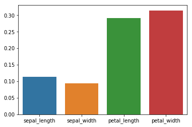


Summary
=======

1. We explored clustering techniques to segment users and dimensionality reduction to improve algorithm performance.  
2. Supervised learning algorithms were covered as a foundation for building collaborative filters.  
3. The lab provided an overview of evaluation metrics for assessing collaborative filters.  
4. For deeper learning, the *Python Machine Learning* course by Sebastian Thrun offers more detailed coverage of these topics.