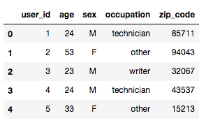
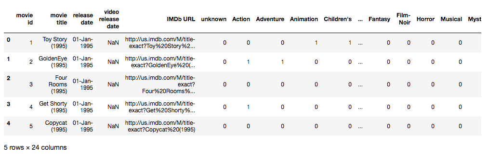
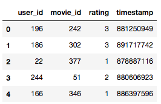
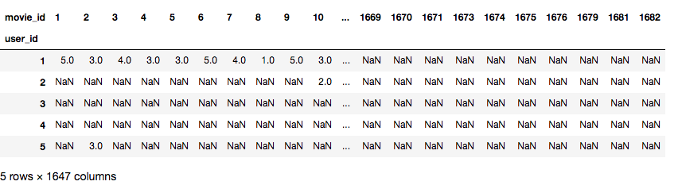
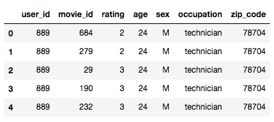
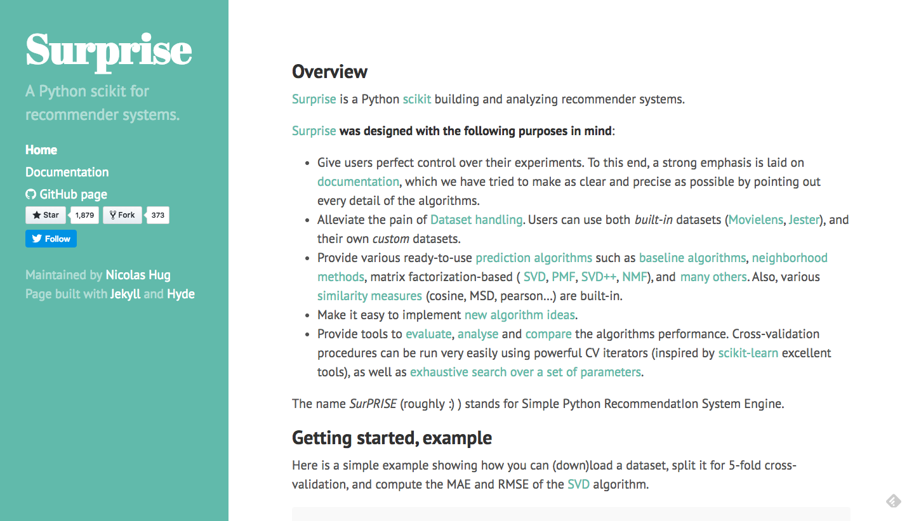
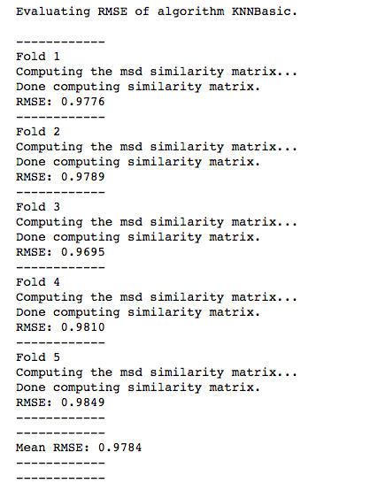
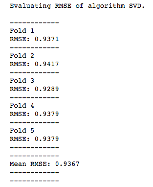

Lab 6: Building Collaborative Filters
=====================================

In the previous lab, we mathematically defined the collaborative
filtering problem and gained an understanding of various data mining
techniques that we assumed would be useful in solving this problem.

The time has finally come for us to put our skills to the test. In the
first section, we will construct a well-defined framework that will
allow us to build and test our collaborative filtering models
effortlessly. This framework will consist of the data, the evaluation
metric, and a corresponding function to compute that metric for a given
model.


The framework
=============

Just like the knowledge-based and content-based recommenders, we will
build our collaborative filtering models in the context of movies. Since
collaborative filtering demands data on user behavior, we will be using
a different dataset known as MovieLens.


The MovieLens dataset
=====================

The MovieLens dataset is made publicly available by GroupLens Research,
a computer science lab at the University of Minnesota. It is one of the
most popular benchmark datasets used to test the potency of various
collaborative filtering models and is usually available in most
recommender libraries and packages:


MovieLens gives us user ratings on a variety of movies and is available
in various sizes. The full version consists of more than 26,000,000
ratings applied to 45,000 movies by 270,000 users. However, for the sake
of fast computation, we will be using the much smaller 100,000 dataset,
which contains 100,000 ratings applied by 1,000 users to 1,700 movies.


Viewing the dataset
=======================

Without any further ado, let\'s go ahead and view the 100,000
dataset. The dataset available on the official GroupLens site does not
provide us with user demographic information anymore. Therefore, we will
use a legacy dataset made available on Kaggle by Prajit Datta.


View the MovieLens 100,000 dataset at
<https://www.kaggle.com/prajitdatta/movielens-100k-dataset/data>.


Unzip the folder and rename it [movielens]. Next, move this
folder into the [data] folder. The
MovieLens dataset should contain around 23 files. However, the only
files we are interested in are [u.data], [u.user], and
[u.item]. Let\'s explore these files in the next section.


Exploring the data
==================

As mentioned in the previous section, we are only interested in three
files in the [movielens] folder: [u.data], [u.user],
and [u.item]. Although these files are not in CSV format, the code
required to load them into a Pandas DataFrame is almost identical.

Let\'s start with [u.user]*:*


```
#Load the u.user file into a dataframe
u_cols = ['user_id', 'age', 'sex', 'occupation', 'zip_code']

users = pd.read_csv('../data/movielens/u.user', sep='|', names=u_cols,
 encoding='latin-1')

users.head()
```


Here is its output:





We see that the [u.user] file contains demographic information
about our users, such as their [age],
[sex], [occupation], and
[zip\_code].

Next, let\'s take a look at the [u.item] file, which gives us
information about the movies that have been rated by our users:


```
#Load the u.items file into a dataframe
i_cols = ['movie_id', 'title' ,'release date','video release date', 'IMDb URL', 'unknown', 'Action', 'Adventure',
 'Animation', 'Children\'s', 'Comedy', 'Crime', 'Documentary', 'Drama', 'Fantasy',
 'Film-Noir', 'Horror', 'Musical', 'Mystery', 'Romance', 'Sci-Fi', 'Thriller', 'War', 'Western']

movies = pd.read_csv('../data/movielens/u.item', sep='|', names=i_cols, encoding='latin-1')

movies.head()
```


Here is its output:





We see that this file gives us information regarding the movie\'s title,
[release date], [IMDb URL], and its
genre(s). Since we are focused on building only collaborative filters in
this lab, we do not require any of this information, apart from the
movie title and its corresponding ID:


```
#Remove all information except Movie ID and title
movies = movies[['movie_id', 'title']]
```


Lastly, let\'s import the [u.data] file into our notebook. This is
arguably the most important file as it contains all the ratings that
every user has given to a movie. It is from this file that we will
construct our ratings matrix:


```
#Load the u.data file into a dataframe
r_cols = ['user_id', 'movie_id', 'rating', 'timestamp']

ratings = pd.read_csv('../data/movielens/u.data', sep='\t', names=r_cols,
 encoding='latin-1')

ratings.head()
```


Here is its output:





We see that every row in our new [ratings] DataFrame denotes a
rating given by a user to a particular movie at a particular time.
However, for the purposes of the exercises in this lab, we are not
really worried about the time at which the ratings were given.
Therefore, we will just go ahead and drop it:


```
#Drop the timestamp column
ratings = ratings.drop('timestamp', axis=1)
```


Training and test data
======================

The [ratings] DataFrame contains user ratings for movies that
range from 1 to 5. Therefore, we can model this problem as an instance
of supervised learning where we need to predict the rating, given a user
and a movie. Although the ratings can take on only five discrete values,
we will model this as a regression problem.

Consider a case where the true rating given by a user to a movie is 5. A
classification model will not distinguish between the predicted ratings
of 1 and 4. It will treat both as misclassified. However, a regression
model will penalize the former more than the latter, which is the
behavior we want.

As we saw in *Lab 5*,
one of the first steps towards building a supervised learning model is
to construct the test and training sets. The model will learn using the
training dataset and its potency will be judged using the testing
dataset.

Let\'s now split our ratings dataset in such a way that 75% of a user\'s
ratings is in the training dataset and 25% is in the testing dataset. We
will do this using a slightly hacky way: we will assume that the
[user\_id] field is the target variable (or [y]) and that
our [ratings] DataFrame consists of the predictor variables (or
[X]). We will then pass these two variables into scikit-learn\'s
[train\_test\_split] function and [stratify] it along *y.*
This ensures that the proportion of each class is the same in both the
training and testing datasets:


```
#Import the train_test_split function
from sklearn.model_selection import train_test_split

#Assign X as the original ratings dataframe and y as the user_id column of ratings.
X = ratings.copy()
y = ratings['user_id']

#Split into training and test datasets, stratified along user_id
X_train, X_test, y_train, y_test = train_test_split(X, y, test_size = 0.25, stratify=y, random_state=42)
```


Evaluation
==========

We know from *Lab 5*
that the RMSE, or root mean squared error, is the most commonly used
performance metric for regressors. We will be using the RMSE to assess
our modeling performance too. [scikit-learn] already gives us an
implementation of the mean squared error. So, all that we have to do is
define a function that returns the square root of the value returned by
[mean\_squared\_error]*:*


```
#Import the mean_squared_error function
from sklearn.metrics import mean_squared_error

#Function that computes the root mean squared error (or RMSE)
def rmse(y_true, y_pred):
    return np.sqrt(mean_squared_error(y_true, y_pred))
```


Next, let\'s define our baseline collaborative filter model. All our
**collaborative filter** (or **CF**) models will take in a
[user\_id] and [movie\_id] as input and output a floating
point number between 1 and 5. We define our baseline model in such a way
that it returns [3] regardless of [user\_id] or
[movie\_id]*:*


```
#Define the baseline model to always return 3.
def baseline(user_id, movie_id):
    return 3.0
```


To test the potency of our model, we compute the RMSE obtained by that
particular model for all user-movie pairs in the test dataset:


```
#Function to compute the RMSE score obtained on the testing set by a model
def score(cf_model):
    
    #Construct a list of user-movie tuples from the testing dataset
    id_pairs = zip(X_test['user_id'], X_test['movie_id'])
    
    #Predict the rating for every user-movie tuple
    y_pred = np.array([cf_model(user, movie) for (user, movie) in id_pairs])
    
    #Extract the actual ratings given by the users in the test data
    y_true = np.array(X_test['rating'])
    
    #Return the final RMSE score
    return rmse(y_true, y_pred)
```


We\'re all set. Let\'s now compute the RMSE obtained by our baseline
model:


```
score(baseline)

OUTPUT:
1.2470926188539486
```


We obtain a score of [1.247]. For the models that we build in the
subsequent sections, we will try to obtain an RMSE that is less than
that obtained for the baseline.


User-based collaborative filtering
==================================

In Lab 1,
*Getting Started with Recommender Systems*, we learned what user-based
collaborative filters do: they find users similar to a particular user
and then recommend products that those users have liked to the first
user.

In this section, we will implement this idea in code. We will build
filters of increasing complexity and gauge their performance using the
framework we constructed in the previous section.

To aid us in this process, let\'s first build a ratings matrix
where each row represents a user and each column represents a movie.
Therefore, the value in the i^th^ row and j^th^ column will denote the
rating given by user [i] to movie [j]. As usual, pandas
gives us a very useful function, called [pivot\_table], to
construct this matrix from our [ratings] DataFrame:


```
#Build the ratings matrix using pivot_table function
r_matrix = X_train.pivot_table(values='rating', index='user_id', columns='movie_id')

r_matrix.head()
```


Here is its output:





We now have a new [r\_matrix] DataFrame, where each row is a user
and each column is a movie. Also, notice that most values in the
DataFrame are unspecified. This gives us a picture of how sparse our
matrix is.


Mean
====

Let\'s first build one of the simplest collaborative filters possible.
This simply takes in [user\_id] and [movie\_id] and outputs
the mean rating for the movie by all the users who have rated it. No
distinction is made between the users. In other words, the rating of
each user is assigned equal weight.

It is possible that some movies are available only in the test set and
not the training set (and consequentially, not in our ratings matrix).
In such cases, we will just default to a rating of [3.0], like the
baseline model:


```
#User Based Collaborative Filter using Mean Ratings
def cf_user_mean(user_id, movie_id):
    
    #Check if movie_id exists in r_matrix
    if movie_id in r_matrix:
        #Compute the mean of all the ratings given to the movie
        mean_rating = r_matrix[movie_id].mean()
    
    else:
        #Default to a rating of 3.0 in the absence of any information
        mean_rating = 3.0
    
    return mean_rating

#Compute RMSE for the Mean model
score(cf_user_mean)

```


```
OUTPUT:
1.0234701463131335
```


We see that the score obtained for this model is lower and therefore
better than the baseline.


Weighted mean
=============

In the previous model, we assigned equal weights to all the users.
However, it makes intuitive sense to give more preference to those users
whose ratings are similar to the user in question than the other users
whose ratings are not.

Therefore, let\'s alter our previous model by introducing a weight
coefficient. This coefficient will be one of the similarity metrics that
we computed in the previous lab. Mathematically, it is represented
as follows:


In this formula, *r*~*u,m*~ represents the rating given by user *u* to
movie *m.*

For the sake of this exercise, we will use the cosine score as our
similarity function (or sim). Recall how we constructed a movie cosine
similarity matrix while building our content-based engine. We will be
building a very similar cosine similarity matrix for our users in this
section.

However, scikit-learn\'s [cosine\_similarity] function does not
work with [NaN] values. Therefore, we will convert all missing
values to zero in order to compute our cosine similarity matrix:


```
#Create a dummy ratings matrix with all null values imputed to 0
r_matrix_dummy = r_matrix.copy().fillna(0)

# Import cosine_score 
from sklearn.metrics.pairwise import cosine_similarity

#Compute the cosine similarity matrix using the dummy ratings matrix
cosine_sim = cosine_similarity(r_matrix_dummy, r_matrix_dummy)

#Convert into pandas dataframe 
cosine_sim = pd.DataFrame(cosine_sim, index=r_matrix.index, columns=r_matrix.index)

cosine_sim.head(10)
```


Here is its output:


With the user cosine similarity matrix in hand, we are now in a position
to efficiently calculate the weighted mean scores for this model.
However, implementing this model in code is a little more nuanced than
its simpler mean counterpart. This is because we need to only consider
those cosine similarity scores that have a corresponding, non-null
rating. In other words, we need to avoid all users that have not rated
movie *m:*


```
#User Based Collaborative Filter using Weighted Mean Ratings
def cf_user_wmean(user_id, movie_id):
    
    #Check if movie_id exists in r_matrix
    if movie_id in r_matrix:
        
        #Get the similarity scores for the user in question with every other user
        sim_scores = cosine_sim[user_id]

        #Get the user ratings for the movie in question
        m_ratings = r_matrix[movie_id]

        #Extract the indices containing NaN in the m_ratings series
        idx = m_ratings[m_ratings.isnull()].index

        #Drop the NaN values from the m_ratings Series
        m_ratings = m_ratings.dropna()

        #Drop the corresponding cosine scores from the sim_scores series
        sim_scores = sim_scores.drop(idx)
        
        #Compute the final weighted mean
        wmean_rating = np.dot(sim_scores, m_ratings)/ sim_scores.sum()
    
    else:
 #Default to a rating of 3.0 in the absence of any information
 wmean_rating = 3.0
 
 return wmean_rating


score(cf_user_wmean)

OUTPUT:
1.0174483808407588
```


Since we are dealing with positive ratings, the cosine similarity score
will always be positive. Therefore, we do not need to explicitly add in
a modulus function while computing the normalizing factor (the
denominator of the equation that ensures the final rating is scaled back
to between 1 and 5).

However, if you\'re working with a similarity metric that can be
negative in this scenario (for instance, the Pearson correlation score),
it is important that we factor in the modulus.

Running this code takes significantly more time than the previous model.
However, we achieve a (very small) improvement in our RMSE score.


User demographics
=================

Let\'s now build a gender demographic filter. All this filter does is
identify the gender of a user, compute the (weighted) mean rating of a
movie by that particular gender, and return that as the predicted value.

Our [ratings] DataFrame does not contain the users\' demographics.
We will import that information from the [users] DataFrame by
merging them into one (using pandas, as usual). Readers familiar with
SQL can see that this is extremely similar to the JOIN functionality:


```
#Merge the original users dataframe with the training set 
merged_df = pd.merge(X_train, users)

merged_df.head()
```


Here is its output:





Next, we need to compute the [mean] rating of each movie by
gender. Pandas makes this possible with the [groupby] method:


```
#Compute the mean rating of every movie by gender
gender_mean = merged_df[['movie_id', 'sex', 'rating']].groupby(['movie_id', 'sex'])         ['rating'].mean()
```


We are now in a position to define a function that identifies the gender
of the user, extracts the average rating given to the movie in question
by that particular gender, and return that value as output:


```
#Set the index of the users dataframe to the user_id
users = users.set_index('user_id')

#Gender Based Collaborative Filter using Mean Ratings
def cf_gender(user_id, movie_id):
    
    #Check if movie_id exists in r_matrix (or training set)
    if movie_id in r_matrix:
        #Identify the gender of the user
        gender = users.loc[user_id]['sex']
        
        #Check if the gender has rated the movie
        if gender in gender_mean[movie_id]:
            
            #Compute the mean rating given by that gender to the movie
            gender_rating = gender_mean[movie_id][gender]
        
        else:
            gender_rating = 3.0
    
    else:
        #Default to a rating of 3.0 in the absence of any information
        gender_rating = 3.0
    
    return gender_rating

score(cf_gender)

OUTPUT:
1.0330308800874282
```


We see that this model actually performs worse than the standard mean
ratings collaborative filter. This indicates that a user\'s gender
isn\'t the strongest indicator of their taste in movies.

Let\'s try building one more demographic filter, but this time using
both gender and occupation:


```
#Compute the mean rating by gender and occupation
gen_occ_mean = merged_df[['sex', 'rating', 'movie_id', 'occupation']].pivot_table(
    values='rating', index='movie_id', columns=['occupation', 'sex'], aggfunc='mean')

gen_occ_mean.head()
```


We see that the [pivot\_table] method gives us the required
DataFrame. However, this could have been done using [groupby] too.
[pivot\_table] is simply a more compact, easier-to-use interface
for the [groupby] method:


```
#Gender and Occupation Based Collaborative Filter using Mean Ratings
def cf_gen_occ(user_id, movie_id):
    
    #Check if movie_id exists in gen_occ_mean
    if movie_id in gen_occ_mean.index:
        
        #Identify the user
        user = users.loc[user_id]
        
        #Identify the gender and occupation
        gender = user['sex']
        occ = user['occupation']
        
        #Check if the occupation has rated the movie
        if occ in gen_occ_mean.loc[movie_id]:
            
            #Check if the gender has rated the movie
            if gender in gen_occ_mean.loc[movie_id][occ]:
                
                #Extract the required rating
                rating = gen_occ_mean.loc[movie_id][occ][gender]
                
                #Default to 3.0 if the rating is null
                if np.isnan(rating):
                    rating = 3.0
                
                return rating
            
    #Return the default rating 
    return 3.0

score(cf_gen_occ)

OUTPUT:
1.1391976012043645
```


We see that this model performs the worst out of all the filters we\'ve
built so far, beating only the baseline. This strongly suggests that
tinkering with user demographic data may not be the best way to go
forward with the data that we are currently using. However, you are
encouraged to try different permutations and combinations of user
demographics to see what performs best. You are also encouraged to try
other techniques of improving the model, such as using a weighted mean
for the [aggfunc] of the [pivot\_table] and experimenting
with different (perhaps more informed) default ratings.


Clustering
==========

In this section, we will use k-means\' sister algorithm, kNN, to build
our clustering-based collaborative filter. In a nutshell, given an user,
*u*, and a movie, *m*, these are the steps involved:

1.  Find the k-nearest neighbors of *u* who have rated movie *m*
2.  Output the average rating of the *k* users for the movie *m*

That\'s it. This extremely simply algorithm happens to be one of the
most popularly used.

Just like kNN, we will not be implementing the kNN-based collaborative
filter from scratch. Instead, we will use an extremely popular and
robust library called [surprise]:





Let\'s now build and evaluate our kNN-based collaborative filter.
Although *surprise* has the MovieLens datasets available within the
library, we will still use the external data we have in order to get a
feel for using the library with alien datasets:


```
#Import the required classes and methods from the surprise library
from surprise import Reader, Dataset, KNNBasic, evaluate

#Define a Reader object
#The Reader object helps in parsing the file or dataframe containing ratings
reader = Reader()

#Create the dataset to be used for building the filter
data = Dataset.load_from_df(ratings, reader)

#Define the algorithm object; in this case kNN
knn = KNNBasic()

#Evaluate the performance in terms of RMSE
evaluate(knn, data, measures=['RMSE'])
```


Here is its output:





The output indicates that the filter is making use of a technique known
as fivefold [cross-validation]. In a nutshell, this means that
[surprise] divides the data into five equal parts. It then uses
four parts as the training data and tests it on the fifth part. This is
done five times, in such a way that every part plays the role of the
test data once.

We see that the RMSE obtained by this model is [0.9784].
This is, by far, the best result we have achieved.

Let\'s now take a tour of some other model-based approaches to
collaborative filtering and implement a few of them using the *surprise*
library.


Let\'s now turn our attention to perhaps the most famous recommendation
algorithm of all time: singular-value decomposition.


Singular-value decomposition
============================

Let\'s now implement the SVD filter using the [surprise] package:


```
#Import SVD
from surprise import SVD

#Define the SVD algorithm object
svd = SVD()

#Evaluate the performance in terms of RMSE
evaluate(svd, data, measures=['RMSE'])
```


Here is its output:





The SVD filter outperforms all other filters, with an RMSE score of
[0.9367].


Summary
=======

1. We built and explored various user-based and item-based collaborative filters.  
2. We introduced model-based approaches using machine learning, including clustering with kNN and supervised learning algorithms for rating predictions.  
3. We gained an understanding of singular-value decomposition (SVD) and implemented it using the *surprise* library.  
4. In the next lab, we'll learn how to deploy our models to the web for public use.