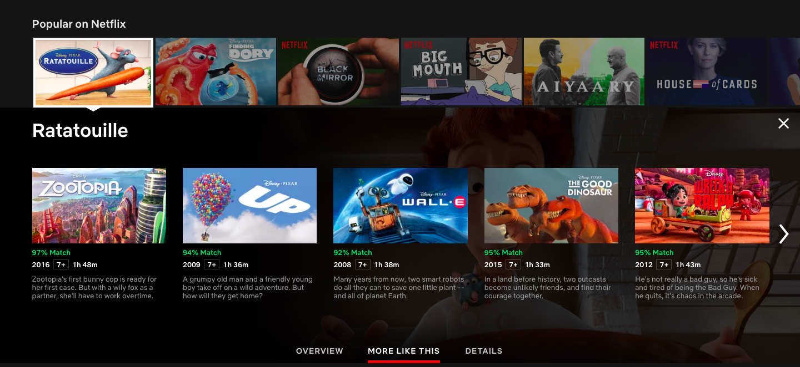
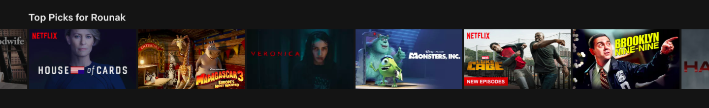
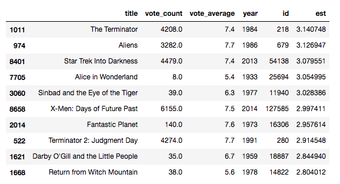
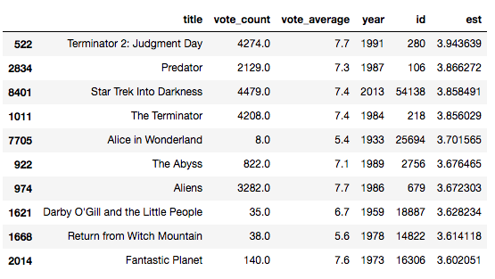

Hybrid Recommenders
===================

In this final lab, we will discuss recommender systems in the
context of practicality and industrial use. Until now, we have learned
about various types of recommender, including knowledge, content, and
collaborative filtering-based engines. However, when used in practice,
each recommender usually suffers from one shortcoming or another.

We\'ve discussed these shortcomings in the very first lab (for
instance, the novelty problem of content-based engines and the cold
start problem of collaborative filters). We also briefly introduced the
concept of the hybrid recommender: a robust system that combines various
models to combat the disadvantage of one model with the advantage of
another. In this lab, we will build a simple hybrid recommender that
combines the content and the collaborative filters that we\'ve built
thus far.


Introduction
============

As already mentioned a couple of times, hybrid recommenders are
extremely powerful, robust systems that combine various simpler models
to give us predictions. There is no single way in which a hybrid model
could do this; some hybrids predict using content and collaborative
filtering techniques separately to produce results. Some others
introduce content-based techniques into collaborative filters and vice
versa.

Netflix is a very good example of a hybrid recommender. Netflix employs
content-based techniques when it shows you similar movies to a movie
you\'re watching (the [MORE LIKE THIS] section), as shown
in the following screenshot:





Here, we can see that while watching *Ratatouille,* Netflix recommends
movies to me that are very similar to *Ratatouille*. All the top five
recommended movies are all animated and produced by Disney Pixar*.*

However, animated movies are not the only genre I watch on Netflix. I
also like watching drama and comedy. Netflix has a separate row of
recommendations for me entitled [Top Picks for Rounak]*,*
where it uses collaborative filtering to identify users similar to me
and recommend movies that they have liked, but that I haven\'t watched:





In this way, Netflix employs both content- and collaborative-based
techniques separately to produce results that are extremely
satisfactory.


Case study -- Building a hybrid model
=====================================

In this section, let\'s build a content-based model that incorporates
some collaborative filtering techniques into it.

Imagine that you have built a website like Netflix. Every time a user
watches a movie, you want to display a list of recommendations in the
side pane (like YouTube). At first glance, a content-based recommender
seems appropriate for this task. This is because, if the person is
currently watching something they find interesting, they will be more
inclined to watch something similar to it.

Let\'s say our user is watching *The Dark Knight.* Since this is a
Batman movie, our content-based recommender is likely to recommend other
Batman (or superhero) movies regardless of quality. This may not always
lead to the best recommendations. For instance, most people who like
*The Dark Knight* do not rate *Batman and Robin* very highly, although
they feature the same lead character. Therefore, we will introduce a
collaborative filter here that predicts the ratings of the movies
recommended by our content-based model and return the top few movies
with the highest predictions.

In other words, the workflow of our hybrid model will be as follows:

1.  Take in a movie title and user as input
2.  Use a content-based model to compute the 25 most similar movies
3.  Compute the predicted ratings that the user might give these 25
    movies using a collaborative filter
4.  Return the top 10 movies with the highest predicted rating

We will be using different datasets for this task. Go ahead and download
the datasets from the following links.

Download the following datasets from Kaggle and Google Drive:

-   [ratings\_small.csv]:
    <https://www.kaggle.com/rounakbanik/the-movies-dataset/downloads/ratings_small.csv/7>.
-   [movie\_ids.csv]:
    <https://drive.google.com/drive/folders/1H9pnfVTzP46s7VwOTcC5ZY_VahRTr5Zv?usp=sharing>.

The [ratings\_small.csv] file contains 100,000 ratings for 9,000
movies from 700 users. We use this file since it contains ratings for
more recent movies (the dataset we used for collaborative filtering only
contained movies released before 1998).

The[ links\_small.csv] file contains the movie IDs of all the
movies rated in the[ ratings\_small.csv] file and their
corresponding titles. We can use these IDs to extract relevant metadata
from the [movies\_metadata.csv] file.

With these files in hand, let\'s proceed to build our model. The first
step is to compute the [cosine\_sim] matrix for our movies. In
addition, we also need to map every movie to the indices in the
[cosine\_sim] matrix. We\'ve already learned how to do this in Lab 3,
*Building an IMDB Top 250 Clone with Pandas*. Computing this matrix and
the mapping, therefore, is left as an exercise for the reader.


You can download my [cosine\_sim ]and[ cosine\_sim\_map]
files from the following link:\
<https://drive.google.com/drive/folders/1H9pnfVTzP46s7VwOTcC5ZY_VahRTr5Zv?usp=sharing>.
However, be aware that the [cosine\_sim] file is over 1 GB in
size, and therefore might take some time to download.


Next, let\'s use the [ratings.csv] file to build a collaborative
filtering model. We will use the SVD model from the last lab for
this purpose:


```
#Build the SVD based Collaborative filter
from surprise import SVD, Reader, Dataset

reader = Reader()
ratings = pd.read_csv('../data/ratings_small.csv')
data = Dataset.load_from_df(ratings[['userId', 'movieId', 'rating']], reader)
data.split(n_folds=5)
svd = SVD()
trainset = data.build_full_trainset()
svd.train(trainset)
```


Next, let\'s load the [movie\_ids.cs][v] file into a
DataFrame and construct two mappings: one that returns the movie title
for a given movie ID, and the other vice versa:


```
#Build title to ID and ID to title mappings
id_map = pd.read_csv('../data/movie_ids.csv')
id_to_title = id_map.set_index('id')
title_to_id = id_map.set_index('title')
```


Now, let\'s import the metadata for our movies so that our recommender
can display useful information, such as the IMDB rating and the year of
release. This information can be extracted from the main
[movies\_metadata.csv ]file, and is again left as an exercise for
the reader.


You can download the required metadata file from the following link:
<https://drive.google.com/drive/folders/1H9pnfVTzP46s7VwOTcC5ZY_VahRTr5Zv?usp=sharing>


We\'re finally in a position to build the hybrid recommender function
according to the workflow described previously:


```
def hybrid(userId, title):
    #Extract the cosine_sim index of the movie
    idx = cosine_sim_map[title]
    
    #Extract the TMDB ID of the movie
    tmdbId = title_to_id.loc[title]['id']
    
    #Extract the movie ID internally assigned by the dataset
    movie_id = title_to_id.loc[title]['movieId']
    
    #Extract the similarity scores and their corresponding index for every movie from the cosine_sim matrix
    sim_scores = list(enumerate(cosine_sim[str(int(idx))]))
    
    #Sort the (index, score) tuples in decreasing order of similarity scores
    sim_scores = sorted(sim_scores, key=lambda x: x[1], reverse=True)
    
    #Select the top 25 tuples, excluding the first 
    #(as it is the similarity score of the movie with itself)
    sim_scores = sim_scores[1:26]
    
    #Store the cosine_sim indices of the top 25 movies in a list
    movie_indices = [i[0] for i in sim_scores]

    #Extract the metadata of the aforementioned movies
    movies = smd.iloc[movie_indices][['title', 'vote_count', 'vote_average', 'year', 'id']]
    
    #Compute the predicted ratings using the SVD filter
    movies['est'] = movies['id'].apply(lambda x: svd.predict(userId, id_to_title.loc[x]['movieId']).est)
    
    #Sort the movies in decreasing order of predicted rating
    movies = movies.sort_values('est', ascending=False)
    
    #Return the top 10 movies as recommendations
    return movies.head(10)
```


Let\'s put our hybrid model to the test. Let\'s imagine that users with
the IDs 1 and 2 are both watching the movie *Avatar:*


```
hybrid(1, 'Avatar')
```





```
hybrid(2, 'Avatar')
```




We can see that although both users are currently watching *Avatar,* the
recommendations differ in the content as well as the order. This is
influenced by the collaborative filter. However, all the movies listed
are similar to *Avatar.* This is because of the content-based filtering
carried out by the model.


Summary
=======

With this, we come to the end of this lab, as well as the main part
of the course. In this course, we learned the following:

-   We were introduced to the world of recommender systems. We defined
    the recommendation problem mathematically and discussed the various
    types of recommendation engines that exist, as well as their
    advantages and disadvantages.
-   We then learned to perform data wrangling with the pandas library
    and familiarized ourselves with two of pandas, most powerful data
    structures: the series and the DataFrame.
-   With our newly found data wrangling techniques, we proceeded to
    build an IMDB Top 250 clone. We then improved on this model to build
    a knowledge-based recommender that took into account the recommended
    movies\' genre, duration, and year of release.
-   Next, we learned how to build content-based recommenders using plot
    lines and subsequently more sophisticated metadata, such as the
    genre, cast, crew, and keywords. In the process, we familiarized
    ourselves with vectorizers and the cosine similarity metric.
-   In the lab on data mining, we were introduced to the various
    techniques used in building and improving recommendation systems. We
    learned about similarity metrics other than the cosine score. We
    then proceeded to study clustering, with an emphasis on k-means
    clustering techniques. This was followed by discussions on
    dimensionality reduction (with an emphasis on PCA) and the various
    supervised learning techniques. the lab concluded with a tour of
    evaluation metrics that are used to gauge the performance of
    recommender systems.
-   the lab on collaborative filtering had us experimenting with a
    variety of models that used rating data, and also leveraged data
    mining techniques introduced in the previous lab. We were also
    introduced to the [surprise] library, which made building
    recommender systems a breeze.
-   In this final lab, we briefly discussed the various kinds of
    hybrid recommender used in the industry today and built a model that
    incorporated collaborative filtering into a content-based engine to
    offer personalized recommendations to a user, while keeping the
    current movie being watched in mind.

What we have covered, of course, only touches the surface of the world
of recommender systems. However, I am positive that readers will now be
in a very good place to tackle advanced topics in the field. I have
listed a few resources in the [Appendix] that could serve as a
next stop on your journey to becoming a recommendations master.

As mentioned earlier, all the code written as part of this course is
available as a GitHub repository to enable you to effortlessly tinker
and experiment with the code as you journey through this course. I\'d like
to thank you all for having come this far. If you have any comments,
corrections, criticism, or suggestions, feel free to contact me at
[rounakbanik\@gmail.com].
